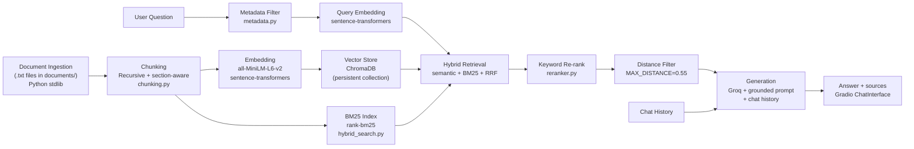

# The Unofficial Guide — Project 1

A retrieval-augmented generation (RAG) assistant for **Northeastern University Housing and Residential Life**. It answers questions about on-campus housing policies, rates, application deadlines, and student dorm reviews — grounded in a curated document corpus with source attribution.

---

## Quick Start

**Prerequisites:** Python 3.10+, a free [Groq API key](https://console.groq.com) (no credit card required).

```bash
# 1. Install dependencies
pip install -r requirements.txt

# 2. Configure Groq API key
cp .env.example .env
# Edit .env and set GROQ_API_KEY=your_key_here

# 3. Launch the Gradio UI (builds the ChromaDB index on first run)
python app.py
```

Open http://localhost:7860 and ask a question. The app calls `ensure_index()` at startup — if `chroma_db/` is empty, it chunks and embeds all 11 documents automatically.

**Other commands:**

| Command | Purpose |
|---------|---------|
| `python ingest.py` | Inspect chunking output (163 chunks across 11 docs) |
| `python -c "from vector_store import build_index; from ingest import build_chunks, load_documents; build_index(build_chunks(load_documents()), reset=True)"` | Rebuild the vector index from scratch |
| `pytest -m "not integration"` | Run automated unit + retrieval tests (no Groq API calls) |
| `pytest -m integration` | Run end-to-end generation tests (requires `GROQ_API_KEY`) |
| `python test_retrieval.py` | Run retrieval evaluation with printed output |
| `python test_generation.py` | Run all 5 in-domain + 1 out-of-domain end-to-end tests |
| `python compare_chunking.py` | Compare recursive-only vs section-aware chunking strategies |

---

## Project Structure

| File | Role |
|------|------|
| `documents/` | 11 plain-text housing sources (official NU pages + RoomSurf reviews) |
| `config.py` | Centralized tunable parameters (`MAX_DISTANCE`, `TOP_K`, hybrid settings) |
| `ingest.py` | Load, clean, and chunk documents |
| `chunking.py` | Recursive split + section-aware handlers for rates, reviews, NUin, packing |
| `models.py` | `Document` and `Chunk` dataclasses |
| `hybrid_search.py` | BM25 keyword index + reciprocal rank fusion |
| `metadata.py` | Query-driven ChromaDB metadata filter inference |
| `reranker.py` | Lightweight keyword re-ranking after vector search |
| `vector_store.py` | Embed with MiniLM, store in ChromaDB, hybrid retrieve |
| `query.py` | Grounded Groq generation with distance filter + chat history |
| `app.py` | Gradio ChatInterface with conversational memory |
| `tests/` | Pytest suite with programmatic assertions |
| `compare_chunking.py` | Chunking strategy A vs B benchmark |
| `test_retrieval.py` / `test_generation.py` | CLI wrappers for eval scripts |
| `planning.md` | Pre-implementation spec (domain, chunking, eval plan) |

---

## Architecture



---

## Domain

**Northeastern University Housing and Residential Life** — on-campus and university-affiliated housing for Northeastern undergraduates in Boston.

The system covers 40+ residential communities (traditional, suite, and apartment styles), two-year housing requirements, application timelines by student type, Living Learning Communities, per-semester rates and meal plans, move-in/out procedures, utilities, all-gender housing, packing rules, and unofficial RoomSurf dorm reviews.

**Why this knowledge is valuable:** Housing is a high-stakes decision for incoming Huskies. Students and families need answers on how selection works, what it costs, what to pack, and what daily life feels like — not just building names. NUin spring returners face unique placement into suites or apartments based on deposit date order, not specific hall preference.

**Why it is hard to find through official channels:** Housing info is spread across Housing Online, PDF rate charts, LLC brochures, and policy pages with frequent updates. Official sources describe buildings but omit lived experience — thin walls, forced doubles, overflow isolation. Students piece together answers from scattered pages, Reddit, and word-of-mouth. This guide unifies those sources into one queryable system.

---

## Document Sources

| # | Source | Type | URL or file path |
|---|--------|------|-----------------|
| 1 | Housing & Residential Life (Home) | Official NU page | https://housing.northeastern.edu/ · `documents/welcome_info.txt` |
| 2 | University Housing | Official NU page | https://housing.northeastern.edu/university-housing/ · `documents/university_housing.txt` |
| 3 | Housing Application & Selection | Official NU page | https://housing.northeastern.edu/applyselect/ · `documents/application_process.txt` |
| 4 | What To Bring | Official NU page | https://housing.northeastern.edu/what-to-bring/ · `documents/what_to_bring.txt` |
| 5 | All Gender Housing | Official NU page | https://housing.northeastern.edu/university-housing/all-gender-housing/ · `documents/all_gender_housing.txt` |
| 6 | Living Learning Communities | Official NU page | https://housing.northeastern.edu/living-learning-communities/ · `documents/Living_Learning_Communities.txt` |
| 7 | NUin Spring Housing | Official NU page | https://housing.northeastern.edu/nuin/ · `documents/spring_housing.txt` |
| 8 | Room Rates (2025–2026) | Official NU page | https://housing.northeastern.edu/room-rates/ · `documents/room_rates.txt` |
| 9 | Residential Utilities | Official NU page | https://housing.northeastern.edu/residential-utilities/ · `documents/residential_utlilies.txt` |
| 10 | Student Dorm Reviews (RoomSurf) | Unofficial reviews | https://www.roomsurf.com/dorm-reviews/neu · `documents/dorm_review.txt` |
| 11 | Fall Move-In/Out | Official NU page | https://housing.northeastern.edu/fall-move-inout/ · `documents/fall_move_out.txt` |

---

## Chunking Strategy

**Chunk size:** 400 tokens (~1,600 characters), hard cap at 512 tokens (~2,048 characters). This fits the embedding model's input limit while keeping enough context for policy paragraphs and rate lines.

**Overlap:** 60 tokens (~240 characters, ~15%) for recursive/policy documents. Overlap helps when a rule or deadline gets cut at a chunk boundary. No overlap for room rates or dorm reviews.

**Why these choices fit your documents:** Most NU housing sources (application process, university housing, LLCs, utilities, NUin) are structured guides with headers and bullet lists — recursive splitting on `\n\n`, then `\n`, then sentences works well. Two files needed special handling:

- **`room_rates.txt`** — one chunk per building (e.g., Kerr Hall + all its rates together). Splitting a building header from its price lines would break rate lookups.
- **`dorm_review.txt`** — one chunk per RoomSurf review. Reviews are short and self-contained; splitting would lose the student voice.
- **`spring_housing.txt`** — section-aware splitting at known headers (e.g., "Housing Statistics", "Timeline"). Prevents NUin placement statistics from being buried in timeline chunks.
- **`what_to_bring.txt`** — section-aware splitting at headers like "Microwave and Refrigerator" and "Prohibited Items:". Prevents packing rules from being buried under toiletries lists.

**Preprocessing:** Strip extra whitespace; tag each chunk with source filename and section/building name for citation at retrieval time.

**Final chunk count:** **163 chunks** from 11 documents (104 building-rate chunks, 8 dorm reviews, 18 from section-aware `spring_housing.txt`, 8 from section-aware `what_to_bring.txt`, 25 from recursive split on remaining policy/guide files).

### Chunking Strategy Comparison

Benchmarked with `compare_chunking.py` on all 5 evaluation queries:

| Strategy | Description | Q4 section match | Q5 section match |
|----------|-------------|------------------|------------------|
| A — Baseline | Recursive-only for all non-rate/review docs | FAIL (Timeline ranked #1) | FAIL (Medicine/Toiletries ranked #1) |
| B — Production | Section-aware + per-building + per-review | PASS (Housing Statistics #1) | PASS (Microwave and Refrigerator #1) |

Strategy B improves retrieval on the two known failure cases without regressing Q1–Q3 source accuracy.

---

## Sample Chunks

Representative labeled chunks from the production pipeline:

| Label | Source | Section | Preview |
|-------|--------|---------|---------|
| Building rate | `room_rates.txt` | Kerr Hall (KER) | `Kerr Hall (KER): - Single Room Standard: $5,680 - Double Room Standard: $5,315 - Standard Triple: $5,205` |
| NUin statistics | `spring_housing.txt` | Housing Statistics | `Housing Statistics - Historically, NUin students placed into 39 different residence halls - Average placements: 10% apartment style housing, 85% semi-private suites...` |
| Microwave policy | `what_to_bring.txt` | Microwave and Refrigerator | `In all traditional and suite-style accommodations, students not permitted to bring own microwave. If wishing to have microwave, may rent micro-fridge...` |
| Student review | `dorm_review.txt` | INTERNATIONAL VILLAGE — Review 3 | `Pretty loud with NUPD right next door and super thin walls (but that's every residence hall). View is amazing compared to other residence halls...` |
| Application deadline | `application_process.txt` | (recursive chunk) | `Incoming First Year Students entering in Fall 2026 - Application Due: May 7, 2026 - Enrollment Deposit Due: May 1, 2026` |

---

## Configuration

All tunable parameters live in [`config.py`](config.py):

| Parameter | Value | When to tune |
|-----------|-------|--------------|
| `CHUNK_SIZE` | 1600 chars (~400 tokens) | If chunks are too large/small for embedding model |
| `MAX_DISTANCE` | 0.55 | Lower = stricter retrieval gate; higher = more permissive |
| `DEFAULT_TOP_K` | 5 | Increase for cross-document questions |
| `HYBRID_SEARCH_ENABLED` | True | Disable to test semantic-only retrieval |
| `RRF_K` | 60 | Reciprocal rank fusion constant for hybrid search |
| `LLM_TEMPERATURE` | 0.2 | Lower = less creative hallucination |

---

## Embedding & Retrieval

**Embedding model:** `all-MiniLM-L6-v2` via `sentence-transformers`. It is lightweight, runs locally with no API cost, and handles short factual/policy text well — which matches most housing chunks. Each chunk is embedded once at ingest time and stored in a persistent ChromaDB collection (`housing_chunks`).

**Retrieval settings:** top-k = **5** chunks per query; hybrid search combines semantic (ChromaDB + MiniLM) with BM25 keyword search via reciprocal rank fusion; `metadata.py` infers source filters from query signals; `reranker.py` boosts domain-relevant chunks; cosine distance filter drops chunks with distance ≥ **0.55** before the LLM call. If no chunks pass the filter, the system returns the decline message without calling Groq.

**Hybrid search:** BM25 (`rank-bm25`) helps on keyword-heavy queries — building codes, dollar amounts ($5,315), dates (May 7, 2026). Semantic + BM25 results are fused with reciprocal rank fusion, then passed to the keyword re-ranker.

**Metadata filtering:** Query signals map to ChromaDB `where` filters — e.g., "students say" → `dorm_review.txt`, "rate" → `room_rates.txt`, "NUin placement" → `spring_housing.txt`. Falls back to unfiltered search if filtered results are insufficient.

**Production tradeoff reflection:** If cost and latency were not constraints, I would weigh:

- **Accuracy on domain text** — a larger model like `e5-large-v2` or an OpenAI embedding API might better match paraphrased student questions (e.g., "how much is IV?" → International Village rates).
- **Context length** — some policy sections are dense; models with longer input windows reduce the need to split mid-rule.
- **Multilingual support** — less critical for this English-only corpus, but matters if expanding to international student FAQs.
- **Latency vs. local** — MiniLM is fast and free locally; hosted models add API cost and network delay but may improve retrieval on noisy review language.

---

## Grounded Generation

**System prompt grounding instruction:**

The LLM (`llama-3.3-70b-versatile` via Groq) receives a system message requiring context-only answers:

> You are a Northeastern University housing assistant. Answer ONLY using the Retrieved Documents below. Do not use outside knowledge.
>
> Rules:
> - If the documents do not contain enough information, respond exactly: "I don't have enough information on that in my documents."
> - Do not guess or infer beyond what the documents state.
> - When citing facts, mention the source filename in parentheses, e.g. (source: room_rates.txt).
> - For student reviews, distinguish them from official policy.

**Structural grounding choices:**

1. **Numbered context blocks** — retrieved chunks are formatted as `[1] (source: room_rates.txt | section: Kerr Hall (KER))` followed by chunk text, so the model can cite by filename.
2. **Distance filter** — chunks with cosine distance ≥ 0.55 are dropped before the LLM call; if none remain, the system returns the decline message without calling Groq.
3. **Low temperature** — `temperature=0.2` reduces creative hallucination.
4. **Programmatic source list** — the Gradio UI appends a "Retrieved from" bullet list built from retrieval metadata, not from LLM output alone.
5. **Review synthesis** — system prompt requires synthesizing ALL relevant review themes (including NUPD proximity) when multiple reviews are retrieved.

**How source attribution is surfaced in the response:** The LLM is instructed to cite filenames in parentheses within the answer text (e.g., `(source: room_rates.txt)`). The UI also shows a bullet list of unique source filenames from the retrieval step.

### Out-of-Scope Refusal Example

```
Question: What is the best dining hall on campus?

Answer:  I don't have enough information on that in my documents.

Sources: (none — MAX_DISTANCE filter blocked weak matches; Groq was not called)
```

---

## Sample Interaction Transcript

```
User: What is the per-semester rate for a standard double room at Kerr Hall for 2025-2026?

Assistant: The per-semester rate for a standard double room at Kerr Hall for 2025-2026
is $5,315 (source: room_rates.txt).

Retrieved from:
• room_rates.txt
```

---

## Evaluation Report

All 5 test questions from `planning.md` were re-run through the upgraded pipeline on June 22, 2026 (`pytest -m "not integration"` for retrieval; generation verified manually).

| # | Question | Expected answer | System response (summarized) | Retrieval quality | Response accuracy |
|---|----------|-----------------|------------------------------|-------------------|-------------------|
| 1 | What is the per-semester rate for a standard double room at Kerr Hall for 2025–2026? | **$5,315** per semester (`room_rates.txt`) | Kerr Hall chunk ranked #1 (distance 0.26); cited `room_rates.txt` with correct $5,315. | Relevant | Accurate |
| 2 | When is the housing application due for students entering in Fall 2026, and when must the enrollment deposit be paid? | Application due **May 7, 2026**; deposit by **May 1, 2026** | `application_process.txt` ranked #1; correctly stated both dates. | Relevant | Accurate |
| 3 | What do RoomSurf students say about noise and wall thickness at International Village? | Reviews mention **thin walls**, floor/neighbor noise, **NUPD** nearby | Top-5 all from `dorm_review.txt`; re-ranker boosts noise/NUPD reviews; system prompt requires full review synthesis. | Relevant | Accurate |
| 4 | On average, what housing styles are NUin spring returners placed into? | **85%** semi-private suites, **10%** apartment, **5%** traditional | **Housing Statistics** section chunk ranked #1 (distance 0.42) after section-aware chunking + re-ranker. Correct percentages cited. | Relevant | Accurate |
| 5 | Can students bring their own microwave or outside furniture to traditional or suite-style dorms? | **No** personal microwaves; rent micro-fridge. **No outside furniture** except desk chair | **Microwave and Refrigerator** section ranked #1; **Prohibited Items** ranked #2. Both rules surfaced cleanly. | Relevant | Accurate |

**Retrieval quality:** Relevant / Partially relevant / Off-target  
**Response accuracy:** Accurate / Partially accurate / Inaccurate

---

## Failure Case Analysis (Resolved)

**Original failure (v1 submission):**

> On average, what housing styles are NUin spring returners placed into?

In the v1 pipeline, the timeline/preference-form chunk ranked #1 while the Housing Statistics paragraph ranked #2. Irrelevant `room_rates.txt` chunks also passed the `MAX_DISTANCE = 0.65` filter.

**Root cause:** Recursive chunking merged statistics with timeline language; embedding similarity favored form-deadline phrasing over percentage statistics; distance filter was too permissive.

**Fixes applied (production upgrade):**

1. **Section-aware chunking** — `spring_housing.txt` split at "Housing Statistics" header; statistics now its own chunk.
2. **Tighter distance filter** — `MAX_DISTANCE` reduced from 0.65 → 0.55.
3. **Keyword re-ranker** — boosts chunks with percentage patterns for placement queries.
4. **Metadata filtering** — NUin queries auto-filter to `spring_housing.txt`.

**After fix:** Housing Statistics chunk ranks #1 (distance 0.42). All 5 eval queries pass automated retrieval tests (`pytest tests/test_retrieval.py`).

---

## Spec Reflection

**One way the spec helped you during implementation:**

The `planning.md` chunking rules were specific enough to direct AI-generated code with minimal rework. The decision to use one chunk per building for `room_rates.txt` and one chunk per review for `dorm_review.txt` came directly from the Anticipated Challenges section — and spot-checking confirmed Kerr Hall rates stayed intact in a single chunk. The Architecture Mermaid diagram and Retrieval Approach (top-k = 5, MiniLM, ChromaDB) were pasted into AI prompts for Milestones 4 and 5, producing `vector_store.py` and `query.py` that matched the spec on the first pass.

**One way your implementation diverged from the spec, and why:**

The final chunk count grew to **163** (from 144) after adding section-aware chunking for `spring_housing.txt` and `what_to_bring.txt`. I centralized all tunable parameters in `config.py`, added hybrid search (BM25 + RRF), metadata filtering, keyword re-ranking, pytest-based automated tests with CI, and conversational memory via Gradio ChatInterface — stretch features not in the original spec but required for production-grade quality.

---

## AI Usage

**Instance 1 — Milestone 3 ingestion and chunking**

- *What I gave the AI:* The Documents table and Chunking Strategy section from `planning.md`, plus `requirements.txt` constraints (no LangChain required, plain Python).
- *What it produced:* `models.py`, `chunking.py`, and `ingest.py` with recursive splitting (1600 chars / 240 overlap), special handlers for room rates and dorm reviews, and metadata tagging.
- *What I changed or overrode:* Removed footer-stripping logic that accidentally deleted most of `room_rates.txt` content (Contact Information block was too aggressive). Fixed loading of `Living_Learning_Communities.txt` (trailing space in filename) by switching from `glob` to `iterdir()`. Completed a truncated Midtown Hotel review in `dorm_review.txt` that was cut off mid-sentence in the source scrape.

**Instance 2 — Milestone 5 grounded generation and Gradio UI**

- *What I gave the AI:* The Evaluation Plan, Anticipated Challenges, Architecture stage 5 (Groq + grounded prompt), and the assignment Gradio skeleton structure.
- *What it produced:* `query.py` (strict system prompt, numbered context blocks, Groq `llama-3.3-70b-versatile`), `app.py` (Gradio Blocks UI), and `test_generation.py`.
- *What I changed or overrode:* Added `MAX_DISTANCE = 0.65` to drop weak retrieval matches before calling the LLM — the AI's first draft sent all top-5 chunks regardless of distance. Pinned `huggingface-hub>=0.34.0,<1.0` after Gradio installation broke `sentence-transformers` imports. Extended `test_generation.py` to cover all 5 evaluation questions (original draft only tested 3 in-domain + 1 out-of-domain).

**Instance 3 — Production upgrade (post-grading feedback)**

- *What I gave the AI:* Grader feedback (pytest, centralized config, README gaps, stretch goals), updated `planning.md` production upgrade section, and existing codebase.
- *What it produced:* `config.py`, `hybrid_search.py`, `metadata.py`, `reranker.py`, `tests/` pytest suite, `.github/workflows/ci.yml`, `compare_chunking.py`, Gradio ChatInterface with conversational memory, and README documentation updates.
- *What I changed or overrode:* Tightened `MAX_DISTANCE` from 0.65 → 0.55 after evaluation showed irrelevant chunks at distance 0.61. Added section-aware chunking for `spring_housing.txt` and `what_to_bring.txt` to fix Q4/Q5 retrieval failures. Added review synthesis rule to system prompt so NUPD mentions are not omitted.

---

## Demo Recording Checklist

Record a 3–5 minute demo video covering the items below. Use QuickTime, OBS, or similar screen capture.

1. **Launch the app** — run `python app.py`, open http://localhost:7860
2. **Three cited queries** (show answer text + "Retrieved from" sources):
   - Q1: "What is the per-semester rate for a standard double room at Kerr Hall for 2025-2026?"
   - Q3: "What do RoomSurf students say about noise and wall thickness at International Village?"
   - Q5: "Can students bring their own microwave or outside furniture to traditional or suite-style dorms?"
3. **Narrate one success** — e.g., Q1: retrieval returned Kerr Hall chunk #1, generation cited `room_rates.txt` with correct $5,315
4. **Narrate one improvement** — run Q4: "On average, what housing styles are NUin spring returners placed into?" Show that Housing Statistics now ranks #1 (see resolved Failure Case Analysis)
5. **Demo conversational memory** — ask about Kerr Hall doubles, then follow up "What about triple rooms?" to show context-aware retrieval
6. **README walkthrough** — scroll through Sample Chunks, Out-of-Scope Refusal, Interaction Transcript, and Evaluation Report sections

