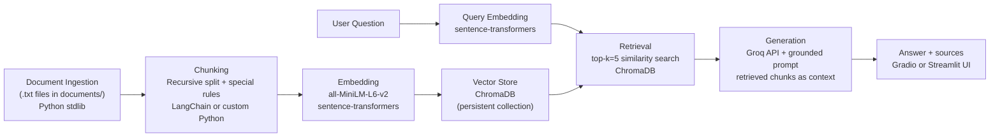

# Project 1 Planning: The Unofficial Guide

> Write this document before you write any pipeline code.
> Your spec and architecture diagram are what you'll use to direct AI tools (Claude, Copilot, etc.) to generate your implementation — the more specific they are, the more useful the generated code will be.
> Update the Retrieval Approach and Chunking Strategy sections if you change your approach during implementation.
> Update this file before starting any stretch features.

---

## Domain

<!-- What domain did you choose? Why is this knowledge valuable and hard to find through official channels? -->

**Northeastern University Housing and Residential Life**

On-campus and university-affiliated housing for Northeastern undergraduates in Boston: policies, costs, application processes, and student lived experience across first-year, NUin, and upperclassmen housing.

### What the domain includes

40+ residential communities in traditional, suite, and apartment styles (Stetson, International Village, West Village, leased properties). Covers two-year housing requirements, application timelines by student type, Living Learning Communities, per-semester rates and meal plans, move-in/out, utilities, all-gender housing, packing rules, and unofficial dorm reviews.

### Why this knowledge is valuable

Housing is a high-stakes decision for incoming Huskies. Students and families need answers on how selection works, what it costs, what to pack, and what daily life feels like—not just building names. NUin spring returners face unique placement into suites or apartments based on deposit date order, not specific hall preference.

### Why it is hard to find through official channels

Housing info is spread across Housing Online, PDF rate charts, LLC brochures, and policy pages with frequent updates. Official sources describe buildings but omit lived experience—thin walls, forced doubles, overflow isolation. Students piece together answers from scattered pages, Reddit, and word-of-mouth. A unified guide fills that gap.

---

## Documents

<!-- List your specific sources: URLs, subreddit names, forum threads, or file descriptions.
     Aim for at least 10 sources that together cover different subtopics or perspectives within your domain. -->

| # | Source | Description | URL or location |
|---|--------|-------------|-----------------|
| 1 | Northeastern Housing & Residential Life (Home) | Overview of 40+ residential communities, eligibility, application links, and contact info | https://housing.northeastern.edu/ · `documents/welcome_info.txt` |
| 2 | University Housing | Housing types (traditional, suite, apartment), building list, first-year requirements, and student eligibility by class | https://housing.northeastern.edu/university-housing/ · `documents/university_housing.txt` |
| 3 | Housing Application & Selection | Application deadlines, deposit rules, and selection timelines for first-years, NUin, transfers, and upperclassmen | https://housing.northeastern.edu/applyselect/ · `documents/application_process.txt` |
| 4 | Move In/Out (Undergraduate) | Term-by-term move-in/out dates, hamper availability, parking, and campus directions | https://housing.northeastern.edu/move-inout/ |
| 5 | Fall Move-In/Out | Fall move-out checklist, moving hampers, parking passes, key return, and fall move-in preparation | https://housing.northeastern.edu/fall-move-inout/ · `documents/fall_move_out.txt` |
| 6 | What To Bring | University-provided items, packing list, Boston climate tips, and prohibited items | https://housing.northeastern.edu/what-to-bring/ · `documents/what_to_bring.txt` |
| 7 | All Gender Housing | How to request all-gender housing, application steps, and policy overview | https://housing.northeastern.edu/university-housing/all-gender-housing/ · `documents/all_gender_housing.txt` |
| 8 | Room Changes | Roommate communication, conflict resolution, facilities requests, and medical accommodations | https://housing.northeastern.edu/room-changes/ |
| 9 | Living Learning Communities | First-year LLC options by college and theme (Engineering, Khoury, Pre-Health, Honors, etc.) | https://housing.northeastern.edu/living-learning-communities/ · `documents/Living_Learning_Communities.txt` |
| 10 | NUin Spring Housing | Spring return placement stats, preference form timeline, and housing style expectations for NUin students | https://housing.northeastern.edu/nuin/ · `documents/spring_housing.txt` |
| 11 | Room Rates | 2025–2026 per-semester rates by building, occupancy type, and meal plan requirements | https://housing.northeastern.edu/room-rates/ · `documents/room_rates.txt` |
| 12 | Residential Utilities | Internet (NUwave), cable, laundry, mail codes, and printing credits | https://housing.northeastern.edu/residential-utilities/ · `documents/residential_utlilies.txt` |
| 13 | Student Dorm Reviews (RoomSurf) | Unofficial student reviews of NU dorms (International Village, Midtown Hotel, West Village, etc.) | https://www.roomsurf.com/dorm-reviews/neu · `documents/dorm_review.txt` |

---

## Chunking Strategy

<!-- How will you split documents into chunks?
     State your chunk size (in tokens or characters), overlap size, and explain why those
     numbers fit the structure of your documents.
     A review-heavy corpus warrants different chunking than a long FAQ. -->

I'm going with **recursive chunking** as the main approach — similar to how you'd chunk API docs where headers and sections give you natural break points. Most of my NU housing sources (application process, university housing, LLCs, utilities, NUin, etc.) are structured that way.

For the two outliers, I'll handle them differently:
- **RoomSurf reviews** (`dorm_review.txt`) — treat like short Yelp-style reviews: one chunk per review, no overlap. They're already self-contained.
- **Room rates** (`room_rates.txt`) — one chunk per building (e.g., Kerr Hall + all its rates together). Overlap would just duplicate prices in retrieval.

**How recursive splitting works:** try to split on `\n\n` first (sections/paragraphs), then `\n` (lines), then sentences, then words — only go to the next level if a chunk is still too big.

**Chunk size:** 400 tokens (~1,600 characters), hard cap at 512 tokens so chunks stay within the embedding model's limit.

**Overlap:** 60 tokens (~240 characters, ~15%) for the recursive/policy docs — helps when a rule or deadline gets cut at a boundary. No overlap for reviews or room rates.

**Before chunking:** strip extra whitespace and tag each chunk with source info (filename, section or building name) so retrieval answers can cite where things came from.

**Expected chunk count:** roughly 80–120 chunks across all documents.

**Final chunk count (after implementation):** 144 chunks from 11 documents (104 from room_rates building entries, 8 dorm reviews, 32 from recursive split on policy/guide files).

**Reasoning:** Official housing pages read like structured guides, not long unstructured transcripts — recursive fits. Reviews and rate tables need their own rules so I don't split a building name away from its prices or break a student review in half.

---

## Retrieval Approach

<!-- Which embedding model are you using (e.g., all-MiniLM-L6-v2 via sentence-transformers)?
     How many chunks will you retrieve per query (top-k)?
     If you were deploying this for real users and cost wasn't a constraint, what tradeoffs
     would you weigh in choosing a different embedding model — context length, multilingual
     support, accuracy on domain-specific text, latency? -->

**Embedding model:** `all-MiniLM-L6-v2` via `sentence-transformers` (already in `requirements.txt`). It's lightweight, runs locally, and handles short factual/policy text well — which matches most of my housing chunks. I'll embed each chunk once at ingest time and store vectors in ChromaDB.

**Top-k:** **5** chunks per query. Housing questions often pull from more than one doc (e.g., NUin placement + LLC info, or building rates + meal plan rules). k=3 felt too tight in early testing scenarios; k=5 gives enough context without flooding the LLM prompt.

**Production tradeoff reflection:** If cost and latency weren't a concern, I'd weigh:
- **Accuracy on domain text** — a larger model like `e5-large-v2` or an OpenAI embedding API might better match paraphrased student questions ("how much is IV?" → International Village rates).
- **Context length** — some policy sections are dense; models with longer input windows reduce the need to split mid-rule.
- **Multilingual support** — less critical for this corpus (English-only NU pages), but matters if expanding to international student FAQs.
- **Latency vs. local** — MiniLM is fast and free locally; hosted models add API cost and network delay but may improve retrieval on noisy review language.

---

## Evaluation Plan

<!-- List your 5 test questions with their expected correct answers.
     Questions should be specific enough that you can judge whether the system's response
     is right or wrong. "What are good dining halls?" is too vague.
     "What do students say about wait times at [dining hall name] during lunch?" is testable. -->

| # | Question | Expected answer |
|---|----------|-----------------|
| 1 | What is the per-semester rate for a standard double room at Kerr Hall for 2025–2026? | **$5,315** per semester (from `room_rates.txt`). |
| 2 | When is the housing application due for students entering in Fall 2026, and when must the enrollment deposit be paid? | Application due **May 7, 2026**; enrollment deposit must be paid by **May 1, 2026**. Assignments processed in enrollment deposit date order. |
| 3 | What do RoomSurf students say about noise and wall thickness at International Village? | Reviews consistently mention **thin walls**, hearing neighbors/floor activity, and noise from **NUPD** nearby; some still praise location, dining hall convenience, and views. |
| 4 | On average, what housing styles are NUin spring returners placed into? | Historically about **85% semi-private suites**, **10% apartment style**, and **5% traditional** first-year halls; placements span many buildings based on preference form and deposit date order. |
| 5 | Can students bring their own microwave or outside furniture to traditional or suite-style dorms? | **No** — personal microwaves are not allowed in traditional/suite halls (rent a micro-fridge instead). **No outside furniture** except a desk chair; also prohibited: tapestry hangings, AC units, halogen lamps, appliances with heating coils. |

---

## Anticipated Challenges

<!-- What could go wrong? Name at least two specific risks with reasoning.
     Consider: noisy or inconsistent documents, missing source attribution, off-topic
     retrieval, chunks that split key information across boundaries. -->

1. **Rate and building info split across chunks** — `room_rates.txt` is long and list-heavy. If recursive splitting breaks a building header from its price lines, a query like "How much is Light Hall double?" could retrieve the wrong hall or an incomplete rate. Mitigation: one chunk per building for rate files (already in chunking plan).

2. **Official policy vs. student review conflict** — RoomSurf reviews describe lived experience (thin walls, overflow Midtown Hotel isolation) that official NU pages don't mention. The model might blend unofficial opinion with policy fact, or cite a review when the user wanted a deadline. Mitigation: source tags on each chunk and a system prompt that distinguishes official policy from student reviews.

3. **Stale or overlapping dates** — documents reference 2025–2026 and 2026–2027 deadlines in different places. Retrieval might return an older term's date unless the answer cites the source file and year explicitly.

4. **Cross-document questions** — questions like "What LLC can NUin students join and when is the preference form due?" need chunks from both `spring_housing.txt` and `Living_Learning_Communities.txt`. If top-k is too low or embeddings match only one side, the answer will be incomplete.

---

## Architecture

<!-- Draw a diagram of your pipeline showing the five stages:
     Document Ingestion → Chunking → Embedding + Vector Store → Retrieval → Generation
     Label each stage with the tool or library you're using.
     You can use ASCII art, a Mermaid diagram, or embed a sketch as an image.
     You'll use this diagram as context when prompting AI tools to implement each stage. -->

**Pipeline summary:**
1. **Ingestion** — read plain-text files from `documents/`, attach metadata (source filename, section).
2. **Chunking** — recursive split (400 tokens, 60 overlap) with per-building and per-review exceptions.
3. **Embedding + store** — embed chunks with MiniLM; persist in ChromaDB with metadata for citation.
4. **Retrieval** — embed user query, fetch top-5 similar chunks.
5. **Generation** — send chunks + question to Groq with a strict grounding prompt; return answer with source filenames.

---

## AI Tool Plan

<!-- For each part of the pipeline below, describe:
     - Which AI tool you plan to use (Claude, Copilot, ChatGPT, etc.)
     - What you'll give it as input (which sections of this planning.md, which requirements)
     - What you expect it to produce
     - How you'll verify the output matches your spec

     "I'll use AI to help me code" is not a plan.
     "I'll give Claude my Chunking Strategy section and ask it to implement chunk_text()
     with my specified chunk size and overlap" is a plan. -->

**Milestone 3 — Ingestion and chunking:**

- **Tool:** Cursor / Claude
- **Input:** Documents table, Chunking Strategy section, and `requirements.txt`
- **Expected output:** `ingest.py` (or similar) that loads all `.txt` files, applies recursive chunking with 400/60 settings, one-chunk-per-building for rates, one-chunk-per-review for RoomSurf, and returns chunk objects with metadata
- **Verify:** print chunk count (~80–120), spot-check that Kerr Hall rates stay in one chunk, and that each dorm review is a single chunk

**Milestone 4 — Embedding and retrieval:**

- **Tool:** Cursor / Claude
- **Input:** Architecture diagram, Retrieval Approach section, and ingestion output format
- **Expected output:** script to embed chunks with `sentence-transformers`, store in ChromaDB, and a `retrieve(query, k=5)` function returning chunks + metadata
- **Verify:** run the 5 evaluation questions through retrieval only — confirm top results come from the expected source files (e.g., question 1 → `room_rates.txt`)

**Milestone 5 — Generation and interface:**

- **Tool:** Cursor / Claude
- **Input:** Evaluation Plan, Anticipated Challenges, Architecture stage 5, Groq API setup from `.env.example`
- **Expected output:** grounded RAG pipeline (Groq LLM + system prompt), simple Gradio/Streamlit chat UI, source attribution in responses
- **Verify:** run all 5 evaluation questions end-to-end; compare answers to expected answers table; log when retrieval is partial or off-target
