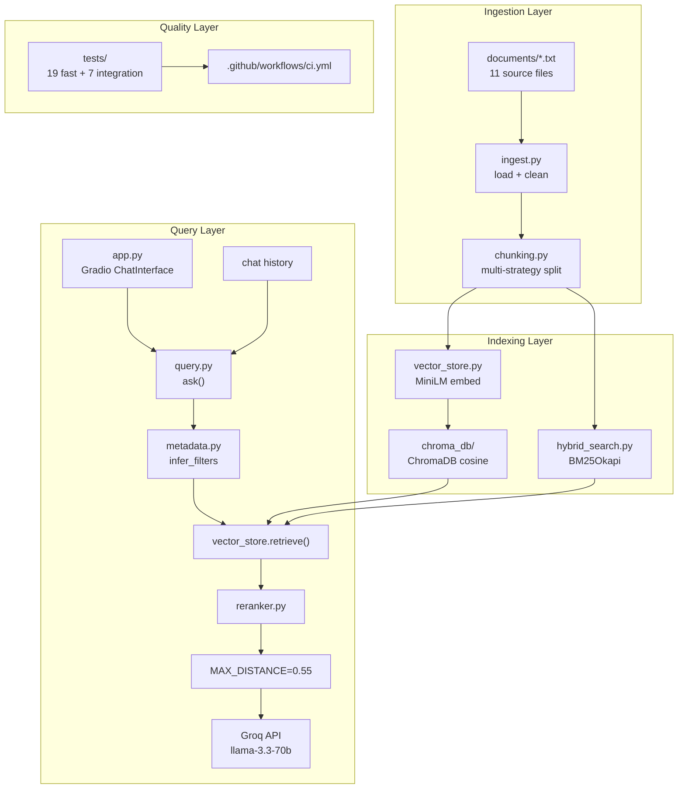

# HousingIQ — Repository Notes

Internal engineering reference for the Northeastern University Housing RAG assistant ("The Unofficial Guide"). Documents what was built, why, how components connect, and how a query flows through the system.

---

## What Was Built

### Core pipeline modules

| File | Purpose |
|------|---------|
| [`models.py`](models.py) | Defines `Document` (filename, raw_text, source_path) and `Chunk` (text, source, section, chunk_index) dataclasses. `Chunk.with_metadata_prefix()` prepends `[Source: filename \| Section: …]` to chunk text so retrieved context is citeable by the LLM and UI. |
| [`ingest.py`](ingest.py) | Loads all 11 `.txt` files from `documents/` via `iterdir()` (handles filenames with trailing spaces, e.g. `Living_Learning_Communities.txt `). `clean_document()` unescapes HTML entities, normalizes line endings, and collapses excess whitespace. `build_chunks()` cleans each document and routes it through `chunk_document()`. `inspect_chunks()` is the CLI health-check printer used by `python ingest.py`. |
| [`chunking.py`](chunking.py) | Multi-strategy chunking router. `chunk_document()` dispatches by filename: per-building regex for `room_rates.txt` (104 chunks), per-review split for `dorm_review.txt` (8 chunks), section-header split for `spring_housing.txt` (18 chunks) and `what_to_bring.txt` (8 chunks), recursive split for all other policy/guide files (25 chunks). **Total: 163 chunks.** Uses `CHUNK_SIZE=1600` chars (~400 tokens), `CHUNK_OVERLAP=240` for recursive splits only. |
| [`config.py`](config.py) | Single source of truth for tunable parameters. Key values: `MAX_DISTANCE=0.55`, `DEFAULT_TOP_K=5`, `HYBRID_SEARCH_ENABLED=True`, `RRF_K=60`, `EMBEDDING_MODEL=all-MiniLM-L6-v2`, `LLM_MODEL=llama-3.3-70b-versatile`, `LLM_TEMPERATURE=0.2`. Exposes frozen `RAGConfig` dataclass as `CONFIG`. |
| [`vector_store.py`](vector_store.py) | Embedding and retrieval orchestration. `build_index()` embeds chunks with MiniLM (batch size 32), stores in ChromaDB collection `housing_chunks` (cosine space), and calls `build_bm25_index()`. `retrieve()` runs the full pipeline: metadata filter → semantic search → optional BM25 fusion → keyword re-rank. `ensure_index()` auto-builds on first run if `chroma_db/` is empty. |
| [`hybrid_search.py`](hybrid_search.py) | BM25 keyword index via `rank_bm25.BM25Okapi`, tokenized with `[a-z0-9]+`. Persisted to `data/bm25_index.pkl`. `bm25_search()` returns top-k hits with pseudo-distance scores. `reciprocal_rank_fusion()` merges semantic and BM25 ranked lists; preserves semantic cosine distance on fused hits (prevents BM25 pseudo-distances from falsely passing the distance gate). |
| [`metadata.py`](metadata.py) | `infer_filters(query)` returns an optional ChromaDB `where` dict based on keyword heuristics — e.g. `"students say"` → `dorm_review.txt`, `"rate"` → `room_rates.txt`, `"nuin"` → `spring_housing.txt`, `"microwave"` → `what_to_bring.txt`, `"application"` (non-NUin) → `application_process.txt`. Returns `None` when no strong signal. |
| [`reranker.py`](reranker.py) | Lightweight post-retrieval re-ranking. `score_chunk()` adjusts cosine distance with domain boosts: Housing Statistics for placement queries, NUPD/noise terms for review queries, Microwave/Prohibited Items sections for packing queries, Kerr Hall building chunks for rate queries. Penalizes timeline chunks on deadline queries. `rerank()` sorts by adjusted distance and returns top-k. |
| [`query.py`](query.py) | Grounded generation entry point. `ask(question, history)` runs: `_retrieval_query()` (concatenates last user turn for follow-ups) → `retrieve()` → `MAX_DISTANCE` gate → Groq chat completion. `normalize_content()` coerces Gradio 6 message content (str/list/dict) to plain text. On decline, returns exact `DECLINE_MESSAGE` with empty sources. `_format_context()` builds numbered `[1] (source: …)` blocks for the LLM prompt. |
| [`app.py`](app.py) | Gradio 6 `ChatInterface` UI. Calls `ensure_index()` at import. `chat_fn()` normalizes message content, converts chat history to OpenAI-style messages, calls `ask()`, and appends a **Retrieved from** bullet list to the answer. Ships 5 example questions from the eval suite. |

### Data and generated artifacts

| Path | Purpose |
|------|---------|
| [`documents/`](documents/) | 11 plain-text source files: 10 official NU housing pages + RoomSurf dorm reviews. Domain corpus for all retrieval. |
| `chroma_db/` | Persistent ChromaDB storage for embedded chunks (gitignored). Created on first `ensure_index()` or `build_index()`. |
| `data/bm25_index.pkl` | Pickled BM25Okapi model + corpus metadata (gitignored). Rebuilt alongside ChromaDB on `build_index()`. |
| `data/cleaned/` | Optional output from `ingest.py` CLI — cleaned copies of source documents for inspection (gitignored). |
| [`.env`](.env) | `GROQ_API_KEY` for generation (gitignored). Template in [`.env.example`](.env.example). |

### Testing and tooling

| File | Purpose |
|------|---------|
| [`tests/conftest.py`](tests/conftest.py) | Session-scoped `indexed_chunks` fixture — builds and indexes all 163 chunks once per pytest run. |
| [`tests/eval_cases.py`](tests/eval_cases.py) | Shared eval definitions: 5 in-domain queries with expected sources/content, out-of-domain dining hall query, follow-up Kerr Hall triple-room test. |
| [`tests/test_chunking.py`](tests/test_chunking.py) | Unit tests: Kerr Hall rates intact, 8 review chunks, isolated Housing Statistics section, isolated Microwave section, total chunk count = 163. |
| [`tests/test_retrieval.py`](tests/test_retrieval.py) | Parameterized retrieval eval (Q1–Q5): source match, distance < 0.55, key content, preferred section for Q4/Q5. |
| [`tests/test_metadata.py`](tests/test_metadata.py) | Filter inference tests + fallback when forced `where` filter returns no matches. |
| [`tests/test_hybrid_search.py`](tests/test_hybrid_search.py) | Hybrid retrieval smoke tests for Kerr Hall rate and NUin statistics section ranking. |
| [`tests/test_generation.py`](tests/test_generation.py) | Integration tests (`@pytest.mark.integration`): 5 in-domain Groq tests, out-of-domain decline, conversational follow-up. |
| [`tests/test_helpers.py`](tests/test_helpers.py) | `contains_all()` and `contains_all_across()` assertion helpers. |
| [`test_retrieval.py`](test_retrieval.py) | CLI wrapper — prints retrieval eval results with PASS/FAIL per query. |
| [`test_generation.py`](test_generation.py) | CLI wrapper — prints end-to-end generation eval results. |
| [`compare_chunking.py`](compare_chunking.py) | Benchmarks Strategy A (recursive-only) vs Strategy B (production multi-strategy) on all 5 eval queries in isolated temp ChromaDB instances. |
| [`.github/workflows/ci.yml`](.github/workflows/ci.yml) | GitHub Actions: fast tests (`pytest -m "not integration"`) on every push/PR; integration tests on push with `GROQ_API_KEY` secret. |
| [`pytest.ini`](pytest.ini) | Defines `integration` marker for Groq API tests. |
| [`planning.md`](planning.md) | Pre-implementation spec, production upgrade notes, stretch feature documentation. |
| [`README.md`](README.md) | User-facing quick start, architecture, eval report, demo checklist. |

---

## Decision Log

### 1. Multi-strategy chunking (not one-size-fits-all)

| | |
|---|---|
| **Decided** | Route by filename in `chunk_document()`: recursive default; per-building for `room_rates.txt`; per-review for `dorm_review.txt`; section-headers for `spring_housing.txt` and `what_to_bring.txt`. |
| **Why** | Evaluation showed recursive-only chunking buried NUin placement statistics under timeline text (eval Q4) and microwave/furniture rules under a toiletries chunk (eval Q5). `compare_chunking.py` confirms Strategy B ranks the correct section #1 on Q4 and Q5 while Q1–Q3 source accuracy is unchanged. |
| **Alternatives considered** | Uniform recursive split across all files; LangChain `RecursiveCharacterTextSplitter`. |
| **Why rejected** | Uniform recursive splits building headers from rate lines and breaks RoomSurf reviews mid-sentence. LangChain adds a dependency without domain-specific control over the 104 building-rate entries. |

### 2. Local MiniLM embeddings + ChromaDB

| | |
|---|---|
| **Decided** | `all-MiniLM-L6-v2` via `sentence-transformers`, embedded once at index time, stored in persistent ChromaDB with cosine distance. |
| **Why** | Free, runs locally, fast for 163 short English chunks. Matches the factual/policy tone of NU housing documents. |
| **Alternatives considered** | OpenAI `text-embedding-3-small`; larger local model (`e5-large-v2`). |
| **Why rejected** | API cost and network latency are unnecessary for a 163-chunk corpus that fits in memory. Larger models add model-load time with marginal retrieval gain on this domain. |

### 3. Hybrid search (BM25 + semantic + RRF)

| | |
|---|---|
| **Decided** | `rank-bm25` BM25Okapi index built alongside ChromaDB; results fused with reciprocal rank fusion (`RRF_K=60`) in `hybrid_search.py`. Enabled by `HYBRID_SEARCH_ENABLED=True`. |
| **Why** | Housing queries often contain exact tokens — building codes (`KER`), dollar amounts (`$5,315`), dates (`May 7, 2026`) — that pure embedding similarity can miss. RRF merges ranked lists without normalizing incompatible score scales. |
| **Alternatives considered** | Semantic-only retrieval; cross-encoder re-ranker (e.g. `ms-marco-MiniLM-L-6-v2`). |
| **Why rejected** | Semantic-only underperforms on keyword-heavy rate/deadline queries. Cross-encoder adds a second neural model load and per-query latency disproportionate to corpus size. |

### 4. Three-layer retrieval refinement

| | |
|---|---|
| **Decided** | Pipeline: `infer_filters()` → semantic + BM25 hybrid → `reranker.py` keyword boosts → `MAX_DISTANCE=0.55` gate before Groq. Fetch `k × 2 = 10` candidates, re-rank down to `k = 5`. |
| **Why** | Each layer fixes a distinct failure mode: wrong source file (metadata), weak embedding rank (hybrid + rerank), borderline similarity (distance gate). Original v1 `MAX_DISTANCE=0.65` let irrelevant `room_rates.txt` chunks through at distance 0.61 on NUin placement queries. |
| **Alternatives considered** | Single semantic top-k pass; tightening k without reranking. |
| **Why rejected** | Single pass could not fix Q4 where timeline chunk ranked above Housing Statistics. Reducing k alone would drop valid cross-section answers (e.g. microwave rules split across two `what_to_bring.txt` sections). |

### 5. Groq `llama-3.3-70b-versatile` with strict grounding prompt

| | |
|---|---|
| **Decided** | Groq API at `temperature=0.2`. System prompt requires context-only answers, exact decline message, filename citations, full review synthesis (including NUPD when present in retrieved chunks). Numbered context blocks in user message. |
| **Why** | Groq free tier requires no credit card. 70B model synthesizes across 5 retrieved chunks reliably. Low temperature reduces hallucination on policy facts. |
| **Alternatives considered** | OpenAI GPT-4; local open-weight LLM. |
| **Why rejected** | OpenAI adds per-token cost for a student project. Running 70B locally is impractical on a laptop without GPU infrastructure. |

### 6. Gradio ChatInterface with conversational memory

| | |
|---|---|
| **Decided** | `gr.ChatInterface` with `chat_fn(message, history)`. `normalize_content()` handles Gradio 6's list/dict message formats. `_retrieval_query()` concatenates the last user turn with the current question for follow-up retrieval only; full history passed separately to Groq for generation. |
| **Why** | Follow-ups like "What about triple rooms?" after a Kerr Hall question need prior context for retrieval. Gradio 6.17 passes message `content` as `[{"text": "..."}]` lists, not plain strings — caused `AttributeError` without normalization. |
| **Alternatives considered** | Single-turn `gr.Blocks` UI; LLM-based query rewriting for follow-ups. |
| **Why rejected** | Single-turn loses conversational UX required by stretch goals. LLM query rewriting adds an extra API call per turn for marginal retrieval gain over simple concatenation. |

---

## Architecture Diagram



### Why each component exists

**Ingestion layer** — Chunking quality is the highest-leverage retrieval lever for this corpus. NU housing documents have heterogeneous structure (rate tables, short reviews, sectioned policy guides) that a single splitter cannot handle. Domain-specific rules in `chunking.py` directly fixed the two known retrieval failures (Q4 NUin statistics, Q5 microwave rules).

**Dual indexes (ChromaDB + BM25)** — Semantic embeddings handle paraphrased student questions ("how much is IV?" → International Village rates). BM25 handles exact lexical matches (building codes, dollar amounts, dates). RRF combines both without requiring score normalization between incompatible ranking functions.

**Metadata filtering** — `infer_filters()` is a zero-cost source pre-filter. When a query clearly targets one document (e.g. "RoomSurf students say" → `dorm_review.txt`), ChromaDB's `where` clause narrows the search space. Falls back to unfiltered search if the filtered query returns fewer than k results.

**Keyword re-ranker** — After vector/BM25 fusion, `reranker.py` applies hand-tuned domain heuristics that fix ranking errors the embedding model makes — e.g. boosting "Housing Statistics" over "Timeline" on placement queries, or NUPD/noise chunks on review queries. Cheaper than a cross-encoder for 163 chunks.

**Distance gate (`MAX_DISTANCE=0.55`)** — Final retrieval filter before the LLM call. Chunks at or above this cosine distance are dropped. If none remain, `ask()` returns the decline message without calling Groq. When Groq itself declines (out-of-domain with weak-but-passing chunks), sources are cleared for consistent UX.

**Chat history** — Retrieval augmentation (`last_user_msg + current_question`) is separate from generation history (prior turns passed as Groq messages). This lets follow-up questions resolve pronouns without polluting the embedding query with assistant response text.

**Quality layer** — 19 fast pytest tests run in CI on every push without API keys. 7 integration tests validate end-to-end Groq behavior when `GROQ_API_KEY` is available. `compare_chunking.py` provides a reproducible before/after benchmark for chunking decisions.

---

## Workflow Walkthrough

Primary use case: a student asks about Kerr Hall rates, then follows up about triple rooms.

### 1. Startup (`python app.py`)

```
app.py imports
  → ensure_index()                          [vector_store.py]
      → get_collection().count() == 0?
          → load_documents()                [ingest.py — 11 files]
          → build_chunks()                  [ingest.py → chunking.py — 163 chunks]
          → build_index()                   [vector_store.py]
              → SentenceTransformer.encode  [all-MiniLM-L6-v2, batch_size=32]
              → collection.add()          [chroma_db/housing_chunks]
              → build_bm25_index()          [hybrid_search.py → data/bm25_index.pkl]
  → gr.ChatInterface.launch()               [http://127.0.0.1:7860]
```

On subsequent runs, `chroma_db/` already exists so indexing is skipped.

### 2. First question: "What is the per-semester rate for a standard double room at Kerr Hall for 2025-2026?"

```
User types question in Gradio ChatInterface
  → chat_fn(message, history)               [app.py]
      → normalize_content(message)          [query.py — str/list/dict → str]
      → ask(question, history=None)        [query.py]

ask():
  1. retrieval_q = question               [_retrieval_query — no history yet]

  2. retrieve(question, k=5)               [vector_store.py]
      a. candidate_k = 10                  [k × RETRIEVAL_CANDIDATE_MULTIPLIER]
      b. infer_filters("…Kerr Hall…rate") → {"source": "room_rates.txt"}
      c. _semantic_search(query, 10, where=room_rates.txt)
      d. bm25_search(query, 10)            [hybrid_search.py]
      e. reciprocal_rank_fusion([semantic, bm25], k=10)
         — preserves semantic distance on fused hits
      f. rerank(query, fused, k=5)        [reranker.py]
         — boosts Kerr Hall (KER) building chunk

  3. Filter: keep chunks where distance < 0.55
     → top hit: room_rates.txt / Kerr Hall (KER) / distance ≈ 0.26
     → text contains "$5,315" double rate

  4. _format_context(chunks) → numbered blocks:
     [1] (source: room_rates.txt | section: Kerr Hall (KER))
     Kerr Hall (KER): - Double Room Standard: $5,315 ...

  5. Groq chat.completions.create(
       model=llama-3.3-70b-versatile,
       messages=[system_prompt, user_message_with_context],
       temperature=0.2
     )

  6. Return {answer, sources: ["room_rates.txt"], chunks: [...]}

  → app.py appends "**Retrieved from:**\n• room_rates.txt"
  → Gradio displays answer in chat
```

### 3. Follow-up: "What about triple rooms?"

```
User sends follow-up
  → chat_fn(message, history=[{role:user,…}, {role:assistant,…}])
      → _history_to_messages(history)     [app.py — normalize_content per turn]
      → ask("What about triple rooms?", history=prior)

ask():
  1. _retrieval_query():
     last_user = "What is the per-semester rate for a standard double room at Kerr Hall…"
     retrieval_q = "What is the per-semester rate… What about triple rooms?"

  2. retrieve(retrieval_q, k=5)
     → infer_filters sees "rate" + Kerr context → room_rates.txt
     → Kerr Hall (KER) chunk ranks #1 with "$5,205" Standard Triple

  3. Groq receives:
     [system_prompt]
     [prior user message]
     [prior assistant answer]
     [user: Retrieved Documents: [1] Kerr Hall rates… Question: What about triple rooms?]

  4. Answer: "$5,205 per semester for Standard Triple at Kerr Hall (source: room_rates.txt)"
```

### 4. Out-of-domain: "What is the best dining hall on campus?"

```
ask("What is the best dining hall on campus?"):
  1. infer_filters() → None (no housing source signal)
  2. retrieve() → weak matches from university_housing.txt, dorm_review.txt
     (semantic distances ≈ 0.35–0.46, all below 0.55 gate)
  3. Groq called with weak context → returns decline message
  4. ask() detects DECLINE_MESSAGE in answer
     → returns {answer: "I don't have enough information…", sources: [], chunks: []}
```

No dining hall content exists in the 11-document corpus. The LLM correctly refuses rather than hallucinating a dining recommendation.

### 5. Regression safety

```bash
# Fast tests (no API key, ~5s) — run in CI on every push
pytest -m "not integration" -v
# 19 tests: chunking invariants, 5 retrieval evals, metadata, hybrid

# Integration tests (requires GROQ_API_KEY in .env)
pytest -m integration -v
# 7 tests: 5 in-domain generation, out-of-domain decline, follow-up triple rate

# Manual eval with printed output
python test_retrieval.py
python test_generation.py

# Chunking strategy benchmark
python compare_chunking.py
# Strategy B wins Q4 (Housing Statistics #1) and Q5 (Microwave section #1)
```
