# HousingIQ — Research Notes

A self-contained technical reference for the Northeastern University housing RAG assistant. This document explains every concept used in the pipeline: underlying theory, mathematical foundations, design decisions, failure modes, and exact code locations. No other document is required to understand the system.

---

## 1. Project Overview

### 1.1 Problem Statement

Northeastern University on-campus housing information is distributed across heterogeneous sources: official policy pages, a 100+ building rate table, student reviews (RoomSurf), NUin spring-returner guides, move-in packing lists, and LLC documentation. A student asking *"What is the per-semester rate for Kerr Hall?"* or *"Can I bring my own microwave?"* must otherwise navigate multiple web properties with inconsistent structure and no unified citation mechanism.

The precise failure without a retrieval system: a general-purpose LLM will answer from parametric (training-time) knowledge, which is stale, unverifiable, and frequently wrong on institution-specific rates, deadlines, and policy exceptions.

### 1.2 Why RAG Fits This Domain

**Retrieval-Augmented Generation (RAG)** (Lewis et al., 2020) decouples *knowledge storage* from *language generation*. The corpus is 11 curated plain-text files in `documents/` (~163 indexed chunks after production chunking). At query time the system:

1. Retrieves the top-k most relevant chunks from a search index.
2. Injects those chunks into the LLM prompt as explicit context.
3. Instructs the LLM to answer only from that context and cite source filenames.

RAG is preferred over alternatives for this project:

| Alternative | Why rejected |
|-------------|--------------|
| **Fine-tuning** | Corpus is small (11 files), changes frequently (annual rates), requires GPU training infra, no per-answer citation |
| **Raw prompting** (no retrieval) | LLM hallucinates rates/deadlines; no source attribution; fails eval on institution-specific facts |
| **Full document stuffing** | 11 files exceed practical context windows when combined; irrelevant text dilutes attention |

### 1.3 System Pipeline

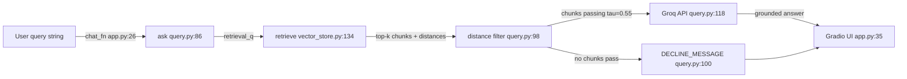

### 1.4 Corpus and Chunk Inventory

- **Documents:** 11 `.txt` files loaded via [`ingest.py:19-35`](ingest.py) from `documents/`.
- **Production chunks:** 163 total after [`chunking.py:299-316`](chunking.py) routing (104 building-rate entries, 8 RoomSurf reviews, 51 policy/section chunks — verified by `python ingest.py`).
- **Indexes:** ChromaDB persistent store at `chroma_db/` ([`vector_store.py:35-40`](vector_store.py)); BM25 pickle at `data/bm25_index.pkl` ([`hybrid_search.py:40-43`](hybrid_search.py)).

### 1.5 Tunable Constants

| Constant | Value | Location | Subsystems affected |
|----------|-------|----------|---------------------|
| `EMBEDDING_MODEL` | `all-MiniLM-L6-v2` | [`config.py:13`](config.py) | Chroma indexing, semantic search |
| `DEFAULT_TOP_K` | 5 | [`config.py:15`](config.py) | Retrieval output, LLM context size |
| `RETRIEVAL_CANDIDATE_MULTIPLIER` | 2 | [`config.py:16`](config.py) | Candidate pool before rerank (10 for k=5) |
| `MAX_DISTANCE` | 0.55 | [`config.py:17`](config.py) | Relevance gate before LLM call |
| `BATCH_SIZE` | 32 | [`config.py:18`](config.py) | Embedding throughput |
| `HYBRID_SEARCH_ENABLED` | `True` | [`config.py:21`](config.py) | BM25 + RRF path |
| `RRF_K` | 60 | [`config.py:23`](config.py) | Reciprocal rank fusion constant |
| `CHUNK_SIZE` | 1600 chars | [`config.py:31`](config.py) | Recursive chunking |
| `CHUNK_OVERLAP` | 240 chars | [`config.py:32`](config.py) | Recursive chunking overlap |
| `MIN_CHUNK_LEN` | 50 chars | [`config.py:34`](config.py) | Post-chunk filter |
| `LLM_MODEL` | `llama-3.3-70b-versatile` | [`config.py:26`](config.py) | Groq generation |
| `LLM_TEMPERATURE` | 0.2 | [`config.py:27`](config.py) | Generation stochasticity |
| `DECLINE_MESSAGE` | exact string | [`config.py:28`](config.py) | Out-of-scope refusal |

---

## 2. Concepts (Dependency Order)

Each section is self-contained. Sections build on prior concepts in pipeline order.

---

### 2.1 Data Models and Document Ingestion

#### Problem statement

Without typed data structures and a deterministic ingestion path, chunk text, source filenames, and section labels propagate as untyped dicts or loose strings. Errors in field naming surface late — at retrieval or generation — rather than at index build time.

#### Theory and mechanics

The pipeline uses two `@dataclass` types defined in [`models.py:4-28`](models.py):

- **`Document`** ([`models.py:4-8`](models.py)): immutable record of a raw file (`filename`, `raw_text`, `source_path`). Represents the pre-chunking artifact.
- **`Chunk`** ([`models.py:11-28`](models.py)): the atomic retrieval unit (`text`, `source`, `section`, `chunk_index`). `section` carries human-readable partition labels (e.g., `"Housing Statistics"`, `"Kerr Hall (KER)"`).

`Chunk.with_metadata_prefix()` ([`models.py:18-28`](models.py)) prepends `[Source: {source} | Section: {section}]\n` to chunk text. This prefix is embedded in the string that gets encoded and stored — not merely stored as Chroma metadata.

**Ingestion flow** ([`ingest.py:19-62`](ingest.py)):

1. `load_documents()` — iterates `documents_dir.iterdir()` ([`ingest.py:22`](ingest.py)), reads UTF-8 text, strips filename whitespace ([`ingest.py:30`](ingest.py)).
2. `clean_document()` — HTML entity unescape, `\r\n` normalization, line trim, collapse of 3+ newlines ([`ingest.py:38-46`](ingest.py)).
3. `build_chunks()` — per-document clean → `chunk_document()` ([`ingest.py:56-62`](ingest.py)).

#### Mathematical / algorithmic foundations

Cleaning is \(O(n)\) in document length where \(n\) = character count. No probabilistic component. Chunk count is deterministic given fixed input files and chunking parameters.

#### Literature and known limitations

Typed pipeline artifacts are standard in production ML systems (feature stores, ETL schemas). Dataclasses provide zero-cost abstraction in Python 3.10+ with auto-generated constructors. Limitation: dataclasses are mutable by default; accidental in-place mutation of `Chunk.text` after prefixing would corrupt the index.

#### This project's design

- **Prefix in text, not metadata-only:** Chroma metadata (`source`, `section`, `chunk_index`) enables filtering ([`vector_store.py:72-77`](vector_store.py)) but the LLM context assembler reads `chunk["text"]` ([`query.py:47`](query.py)). Prefix-in-text guarantees the embedding model and the LLM both see citation headers. Cost: ~30 characters × 163 chunks of wasted embedding capacity.
- **`iterdir()` not `glob("*.txt")`:** One corpus file is named `Living_Learning_Communities.txt ` with a trailing space ([`ingest.py:22-26`](ingest.py)). `glob` would miss it.
- **v1 lesson:** Aggressive footer-stripping regex was removed after it deleted the majority of `room_rates.txt` content during early development.

#### Code anchors

| Function | Lines | Role |
|----------|-------|------|
| `Document` | [`models.py:4-8`](models.py) | Raw file record |
| `Chunk.with_metadata_prefix` | [`models.py:18-28`](models.py) | Citation prefix injection |
| `load_documents` | [`ingest.py:19-35`](ingest.py) | File discovery and read |
| `clean_document` | [`ingest.py:38-46`](ingest.py) | Normalization |
| `build_chunks` | [`ingest.py:56-62`](ingest.py) | Clean + chunk per file |


> **Critical Failure Mode**
> If `with_metadata_prefix()` is called twice on the same chunk without the guard at [`models.py:21-22`](models.py), the prefix duplicates inside the embedding vector, shifting semantic position and degrading retrieval for that chunk. The guard checks `self.text.startswith(prefix)` before appending.

---

### 2.2 Chunking Strategies

#### Problem statement

Chunk boundaries define the atomic unit of retrieval. A chunk that merges two semantically distant sections (e.g., "Housing Statistics" and "Timeline" in `spring_housing.txt`) forces the embedding to represent a blended topic vector. Queries about placement percentages retrieve deadline language instead because deadline terms dominate term frequency in the merged chunk.

#### Theory and mechanics

Chunking is **document-type-dependent**. `chunk_document()` ([`chunking.py:299-316`](chunking.py)) routes by filename:

| Filename | Strategy | Function | Lines |
|----------|----------|----------|-------|
| `room_rates.txt` | One chunk per building block | `chunk_room_rates` | [`chunking.py:157-198`](chunking.py) |
| `dorm_review.txt` | One chunk per RoomSurf review | `chunk_reviews` | [`chunking.py:260-296`](chunking.py) |
| `spring_housing.txt` | Section-header split | `chunk_spring_housing` | [`chunking.py:250-252`](chunking.py) |
| `what_to_bring.txt` | Section-header split | `chunk_what_to_bring` | [`chunking.py:255-257`](chunking.py) |
| All others | Recursive character split | `recursive_chunk` | [`chunking.py:138-155`](chunking.py) |

**Recursive chunking** ([`chunking.py:105-136`](chunking.py)): separator priority `\n\n` → `\n` → `. ` → ` ` ([`chunking.py:49`](chunking.py)). `_merge_splits()` ([`chunking.py:73-102`](chunking.py)) accumulates splits until `CHUNK_SIZE=1600` characters, then carries forward `CHUNK_OVERLAP=240` characters into the next chunk.

**Header-aware chunking** ([`chunking.py:202-247`](chunking.py)): builds a multiline regex from `SPRING_HOUSING_SECTIONS` ([`chunking.py:10-33`](chunking.py)) or `WHAT_TO_BRING_SECTIONS` ([`chunking.py:35-47`](chunking.py)), longest-header-first to avoid partial matches ([`chunking.py:214`](chunking.py)). Each matched section body becomes one `Chunk` with `section=section_name`.

Post-processing in `chunk_document()` ([`chunking.py:312-316`](chunking.py)): filter `len(text) >= MIN_CHUNK_LEN`, apply `with_metadata_prefix()`, reassign `chunk_index` sequentially.

#### Mathematical / algorithmic foundations

Let chunk size \(S = 1600\) characters, overlap \(O = 240\) characters. Effective unique content per chunk (excluding overlap) is approximately \(S - O = 1360\) characters. Token budget is roughly \(S/4 \approx 400\) tokens under English heuristics — within `all-MiniLM-L6-v2` max sequence length (256 word-piece tokens; character-level truncation occurs inside the encoder).

Building-block regex ([`chunking.py:52-55`](chunking.py)):
```
^([^\n]+?\([A-Z0-9/]+\):\s*\n(?:- .+(?:\n|$))+)
```
Matches `"Kerr Hall (KER):\n- Double Bedroom: $5,315\n..."` as an atomic unit.

#### Literature and known limitations

Lewis et al. (2020) and subsequent RAG surveys (Gao et al., 2023) identify chunk size as a first-order retrieval hyperparameter. Smaller chunks improve precision; larger chunks improve context completeness for generation. No universal optimum exists — it is corpus-dependent. Header-aware splitting is a domain-specific alternative to semantic chunking (embedding-based boundary detection), which adds latency and model dependency.

#### This project's design

**Strategy A vs Strategy B** ([`compare_chunking.py:16-25`](compare_chunking.py), [`compare_chunking.py:73-93`](compare_chunking.py)):
- **Strategy A (baseline):** recursive-only for all non-rate/review documents.
- **Strategy B (production):** current `chunk_document()` router.

Benchmark results (semantic-only retrieval, `use_hybrid=False`):
- **Q4** ("NUin spring returner placement"): Strategy A ranked Timeline section #1; Strategy B ranks Housing Statistics #1 with `85%` content.
- **Q5** ("microwave / outside furniture"): Strategy A buried microwave rules under "Medicine and Toiletries" in a 1605-char chunk; Strategy B isolates `"Microwave and Refrigerator"` section.

Overlap is disabled for rates and reviews (zero-overlap by construction — one logical unit per chunk). Overlap is enabled only for recursive policy documents to prevent sentence bisection at boundaries.

#### Code anchors

| Component | Lines |
|-----------|-------|
| Separator list | [`chunking.py:49`](chunking.py) |
| `_recursive_split` | [`chunking.py:105-136`](chunking.py) |
| `chunk_by_known_headers` | [`chunking.py:202-247`](chunking.py) |
| `chunk_document` router | [`chunking.py:299-316`](chunking.py) |
| Benchmark Strategy A | [`compare_chunking.py:16-25`](compare_chunking.py) |

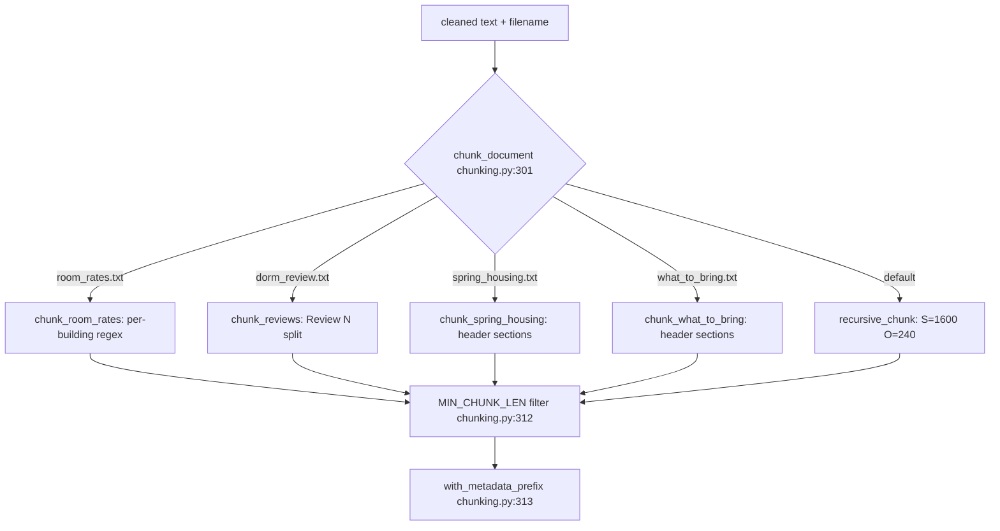

> **Critical Failure Mode**
> Applying uniform recursive chunking to structured guides merges semantically distant sections into one embedding. The embedding vector becomes an average of unrelated topics; a query about placement statistics retrieves deadline language because "preference form due" terms dominate local term frequency. This was the root cause of eval Q4 failure in v1. Fix: section-header routing at [`chunking.py:305-308`](chunking.py) plus reranker boost at [`reranker.py:31-37`](reranker.py).

---

### 2.3 Dense Text Embeddings

#### Problem statement

Lexical matching (exact string overlap) fails on paraphrase: *"How much does IV cost?"* vs *"International Village per-semester rate"*. Dense embeddings map text into a continuous vector space where semantic proximity approximates meaning proximity, enabling retrieval by paraphrased queries.

#### Theory and mechanics

This project uses a **bi-encoder** architecture: query and document are encoded independently; relevance is scored by vector similarity. Model: `all-MiniLM-L6-v2` via `sentence-transformers` ([`config.py:13`](config.py), [`vector_store.py:28-32`](vector_store.py)).

**Index time** ([`vector_store.py:56-89`](vector_store.py)): for each `Chunk`, `model.encode(batch)` produces a list of float vectors. Stored in ChromaDB via `collection.add(ids, documents, metadatas, embeddings)` ([`vector_store.py:85-89`](vector_store.py)).

**Query time** ([`vector_store.py:97-131`](vector_store.py)): `model.encode(query)` produces a single query vector; `collection.query(query_embeddings, n_results=k)` returns nearest neighbors.

The model is loaded lazily as a module singleton ([`vector_store.py:28-32`](vector_store.py)) — first call downloads ~80MB weights from Hugging Face.

#### Mathematical / algorithmic foundations

Bi-encoder mapping:

\[
f_\theta: \mathcal{T} \rightarrow \mathbb{R}^{d}, \quad d = 384
\]

Cosine similarity between query embedding \(\mathbf{q}\) and chunk embedding \(\mathbf{c}\):

\[
\text{sim}(\mathbf{q}, \mathbf{c}) = \frac{\mathbf{q} \cdot \mathbf{c}}{\|\mathbf{q}\| \|\mathbf{c}\|}
\]

ChromaDB collection is created with `metadata={"hnsw:space": "cosine"}` ([`vector_store.py:50-52`](vector_store.py)). Chroma returns **cosine distance**:

\[
d_{\text{cos}} = 1 - \text{sim}(\mathbf{q}, \mathbf{c})
\]

Range: \(d_{\text{cos}} \in [0, 2]\) in general; for L2-normalized embeddings (sentence-transformers default), \(d_{\text{cos}} \in [0, 1]\) where 0 = identical direction, 1 = orthogonal.

**Model internals:** `all-MiniLM-L6-v2` is a 6-layer Transformer distilled from MiniLM, 22M parameters, mean-pooled token representations, L2-normalized output vectors. Max input: 256 word-piece tokens; longer text is truncated.

#### Literature and known limitations

MTEB benchmarks rank MiniLM models mid-tier on retrieval tasks — strong speed/size tradeoff, weaker on domain jargon and multi-hop reasoning vs. `e5-large-v2` or proprietary API embeddings. Bi-encoders are fast (single forward pass per chunk at index time) but less accurate than cross-encoders that jointly encode query-document pairs (used in reranking at scale).

#### This project's design

- **`BATCH_SIZE = 32`** ([`vector_store.py:81-83`](vector_store.py)): amortizes GPU/CPU matrix multiply overhead during index build.
- **Prefix embedded in text** ([`models.py:18-28`](models.py)): source filename participates in the embedding, biasing vectors toward document identity. Tradeoff: consumes token budget.
- **Alternatives considered:**
  - `intfloat/e5-large-v2` (1024-dim): higher MTEB retrieval scores, ~3× latency, ~10× model size.
  - OpenAI `text-embedding-3-small`: API cost per query + index rebuild vendor dependency.

#### Code anchors

| Component | Lines |
|-----------|-------|
| Model singleton | [`vector_store.py:28-32`](vector_store.py) |
| Cosine space config | [`vector_store.py:50-52`](vector_store.py) |
| Batch encoding | [`vector_store.py:80-83`](vector_store.py) |
| Query encoding | [`vector_store.py:104`](vector_store.py) |

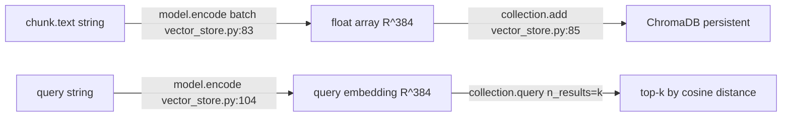

> **Critical Failure Mode**
> After changing chunking logic or `with_metadata_prefix()` format, the on-disk `chroma_db/` index contains stale vectors. `ensure_index()` ([`vector_store.py:168-173`](vector_store.py)) only rebuilds when `collection.count() == 0` — it does **not** detect content changes. Queries return plausible-but-wrong chunks with no error. Fix: `build_index(chunks, reset=True)` or delete `chroma_db/` and `data/bm25_index.pkl`.

---

### 2.4 Vector Database and Approximate Nearest Neighbor Search

#### Problem statement

Brute-force nearest-neighbor search over 163 vectors is trivial; at scale (millions of chunks) linear scan is infeasible. A vector database provides persistent storage, metadata filtering, and approximate nearest neighbor (ANN) algorithms for sub-linear query time.

#### Theory and mechanics

**ChromaDB** ([`vector_store.py:35-53`](vector_store.py)): `PersistentClient(path=str(CHROMA_DIR))` stores vectors on disk at `chroma_db/`. Collection name: `housing_chunks` ([`config.py:14`](config.py)).

**Query path** in `_semantic_search()` ([`vector_store.py:97-131`](vector_store.py)):
1. Encode query to embedding ([`vector_store.py:104`](vector_store.py)).
2. Build `query_kwargs` with `n_results=k`, optional `where` metadata filter ([`vector_store.py:106-112`](vector_store.py)).
3. `collection.query()` returns `documents`, `metadatas`, `distances`.
4. Zip into hit dicts with `text`, `source`, `section`, `chunk_index`, `distance` ([`vector_store.py:121-130`](vector_store.py)).

**ANN algorithm:** Chroma defaults to HNSW (Hierarchical Navigable Small World graphs). Builds a multi-layer proximity graph at index time; query traverses graph greedily toward the query vector. Complexity: approximately \(O(\log n)\) per query vs. \(O(n)\) exact. Tradeoff: recall < 100% — some true nearest neighbors may be missed.

**Relevance gate** in `ask()` ([`query.py:98`](query.py)):
```python
chunks = [c for c in chunks if c["distance"] < MAX_DISTANCE]
```
where `MAX_DISTANCE = 0.55` ([`config.py:17`](config.py)). Chunks failing the gate never reach the LLM.

**Candidate over-fetch:** `candidate_k = min(count, max(k, k * RETRIEVAL_CANDIDATE_MULTIPLIER))` ([`vector_store.py:145-148`](vector_store.py)). For `k=5`, `RETRIEVAL_CANDIDATE_MULTIPLIER=2` ([`config.py:16`](config.py)): fetch 10 candidates before reranking to top 5.

#### Mathematical / algorithmic foundations

Retrieval returns the set:

\[
\mathcal{R}_k = \underset{c \in \mathcal{C}}{\text{argmin}_k} \; d_{\text{cos}}(\mathbf{q}, \mathbf{c})
\]

Gating filter:

\[
\mathcal{G} = \{c \in \mathcal{R}_k \mid d_{\text{cos}}(\mathbf{q}, \mathbf{c}) < \tau\}, \quad \tau = 0.55
\]

If \(|\mathcal{G}| = 0\), generation is skipped ([`query.py:100-106`](query.py)).

HNSW parameters (Chroma defaults): `M=16` (graph connectivity), `ef_construction=100`, `ef_search=10`. Higher `ef_search` improves recall at query latency cost.

#### Literature and known limitations

Malkov & Yashunin (2018) describe HNSW as the de facto ANN standard for high-dimensional embedding search. Known limitation: ANN recall degrades in very high dimensions; \(d=384\) is well within practical HNSW operating range. Distance thresholds are not calibrated probabilities — \(\tau=0.55\) is empirically tuned, not a confidence score.

#### This project's design

- **v1:** `MAX_DISTANCE = 0.65` hardcoded in `query.py`. NUin-related queries admitted chunks at distance 0.61 with irrelevant content. Production: \(\tau = 0.55` in [`config.py:17`](config.py).
- **Persistent index:** survives process restarts; no re-embedding on each `app.py` launch unless collection is empty.
- **Metadata in Chroma:** `source`, `section`, `chunk_index` ([`vector_store.py:72-77`](vector_store.py)) enable pre-filtering (Section 2.7).

#### Code anchors

| Component | Lines |
|-----------|-------|
| Persistent client | [`vector_store.py:35-40`](vector_store.py) |
| Collection + cosine space | [`vector_store.py:50-52`](vector_store.py) |
| `_semantic_search` | [`vector_store.py:97-131`](vector_store.py) |
| `candidate_k` computation | [`vector_store.py:145-148`](vector_store.py) |
| Distance gate | [`query.py:98`](query.py) |
| `MAX_DISTANCE` | [`config.py:17`](config.py) |

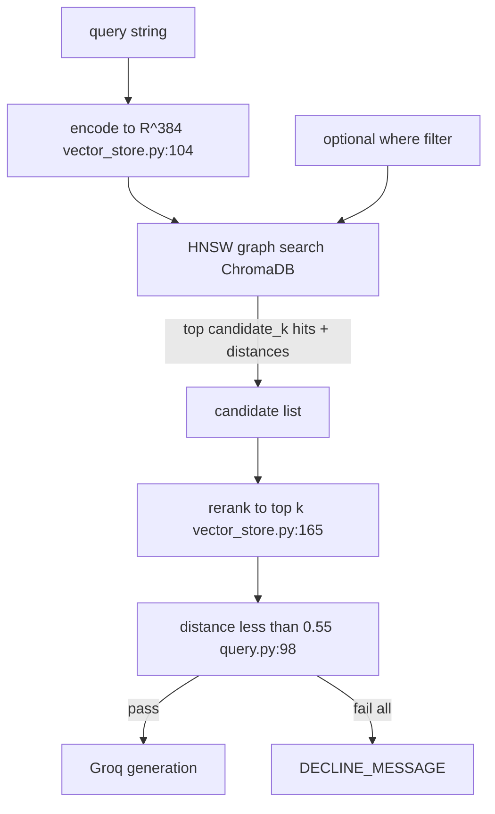

> **Critical Failure Mode**
> Treating `distance=0.55` as "55% confidence" leads to incorrect tuning decisions. Cosine distance is a geometric measure in embedding space, not a calibrated probability of relevance. A chunk at distance 0.54 may be irrelevant; a chunk at 0.56 may be correct but paraphrased. The threshold was set by eval observation, not statistical calibration.

---

### 2.5 BM25 Keyword Retrieval

#### Problem statement

Dense retrieval misses exact-token matches critical in this corpus: dollar amounts (`$5,315`), dates (`May 7, 2026`), building codes (`KER`), and rare proper nouns. BM25 (Best Matching 25) is a sparse lexical retrieval function that scores documents by query term frequency with length normalization and inverse document frequency weighting.

#### Theory and mechanics

Implementation: `rank_bm25.BM25Okapi` ([`hybrid_search.py:8`](hybrid_search.py), [`hybrid_search.py:38`](hybrid_search.py)).

**Index build** ([`hybrid_search.py:23-43`](hybrid_search.py)):
1. Store chunk dicts in `_corpus_chunks` ([`hybrid_search.py:27-36`](hybrid_search.py)).
2. Tokenize each chunk with `[a-z0-9]+` regex ([`hybrid_search.py:13-20`](hybrid_search.py)).
3. Construct `BM25Okapi(tokenized_corpus)`.
4. Persist to `data/bm25_index.pkl` via pickle ([`hybrid_search.py:40-43`](hybrid_search.py)).

**Search** ([`hybrid_search.py:60-88`](hybrid_search.py)):
1. Tokenize query ([`hybrid_search.py:65`](hybrid_search.py)).
2. `scores = _bm25.get_scores(tokens)` — one score per corpus document.
3. Rank by score descending, take top-k ([`hybrid_search.py:70`](hybrid_search.py)).
4. Convert to pseudo-distance: `1.0 - (raw / max_score)` ([`hybrid_search.py:77`](hybrid_search.py)).

#### Mathematical / algorithmic foundations

Okapi BM25 score for query \(q\) and document \(d\):

\[
\text{BM25}(q, d) = \sum_{t \in q} \text{IDF}(t) \cdot \frac{f(t,d) \cdot (k_1 + 1)}{f(t,d) + k_1 \cdot \left(1 - b + b \cdot \frac{|d|}{\text{avgdl}}\right)}
\]

where:
- \(f(t,d)\) = term frequency of \(t\) in \(d\)
- \(|d|\) = document length in tokens
- \(\text{avgdl}\) = average document length in corpus
- \(k_1 \approx 1.5\), \(b \approx 0.75\) (Okapi defaults in `rank_bm25`)
- \(\text{IDF}(t) = \ln\frac{N - n_t + 0.5}{n_t + 0.5 + 1}\) where \(N\) = corpus size, \(n_t\) = document frequency of \(t\)

**Tokenization in this repo:** lowercase alphanumeric only. `"$5,315"` → tokens `["5", "315"]`. `"Kerr Hall (KER)"` → `["kerr", "hall", "ker"]`. Punctuation and currency symbols are stripped.

**Pseudo-distance** ([`hybrid_search.py:77`](hybrid_search.py)):

\[
d_{\text{pseudo}} = 1 - \frac{\text{BM25}(q, d)}{\max_{d'} \text{BM25}(q, d')}
\]

This is a rank-derived normalization, **not** comparable to cosine distance.

#### Literature and known limitations

Robertson & Zaragoza (2009) survey BM25 variants. BM25 remains competitive on lexical benchmarks (BEIR sparse baselines). Known limitations: zero recall on vocabulary mismatch (synonyms with no shared tokens); sensitive to tokenization; no cross-lingual capability.

#### This project's design

- BM25 index rebuilt alongside Chroma on every `build_index()` call ([`vector_store.py:92`](vector_store.py)).
- Global singleton with pickle reload ([`hybrid_search.py:46-57`](hybrid_search.py)).
- Pseudo-distance exists for structural compatibility with hit dicts but must **not** be used for `MAX_DISTANCE` gating — fixed by RRF semantic distance restore (Section 2.6).

#### Code anchors

| Component | Lines |
|-----------|-------|
| Tokenizer | [`hybrid_search.py:13-20`](hybrid_search.py) |
| Index build | [`hybrid_search.py:23-43`](hybrid_search.py) |
| Search + pseudo-distance | [`hybrid_search.py:60-88`](hybrid_search.py) |

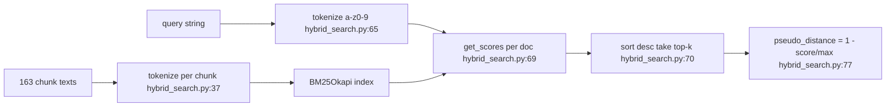

> **Critical Failure Mode**
> Currency amounts tokenize into numeric fragments: `$5,315` → `5`, `315`. BM25 cannot match the full amount as a single token. Retrieval depends on co-occurring lexical signals (`kerr`, `hall`, `double`, `semester`). A query mentioning only `"$5,315"` without building name may return wrong building rate chunks.

---

### 2.6 Hybrid Search and Reciprocal Rank Fusion

#### Problem statement

Dense and sparse retrievers produce scores on incompatible scales. A naive weighted sum requires score normalization that breaks under corpus shift. Hybrid retrieval needs a **rank-based** fusion method that rewards documents appearing highly in multiple retriever lists.

#### Theory and mechanics

`retrieve()` orchestrates hybrid fusion ([`vector_store.py:134-165`](vector_store.py)):

1. Compute `candidate_k` ([`vector_store.py:145-148`](vector_store.py)).
2. Semantic search with metadata filter ([`vector_store.py:152`](vector_store.py)).
3. Fallback to unfiltered if `< k` results ([`vector_store.py:153-154`](vector_store.py)).
4. If `HYBRID_SEARCH_ENABLED` ([`config.py:21`](config.py)): BM25 search ([`vector_store.py:157`](vector_store.py)).
5. `reciprocal_rank_fusion([semantic_hits, keyword_hits], k=candidate_k)` ([`vector_store.py:159`](vector_store.py)).
6. `rerank(query, fused, k)` ([`vector_store.py:165`](vector_store.py)).

**RRF implementation** ([`hybrid_search.py:91-117`](hybrid_search.py)):
- For each result list \(i\) and rank position \(\text{rank}\) (1-indexed):
  \[
  \text{score}_{\text{RRF}}(d) \mathrel{+}= \frac{1}{k_{\text{rrf}} + \text{rank}}
  \]
  with \(k_{\text{rrf}} = 60\) ([`config.py:23`](config.py), [`hybrid_search.py:104`](hybrid_search.py)).
- Sort by RRF score descending; take top-k ([`hybrid_search.py:110-112`](hybrid_search.py)).
- **Semantic distance restore:** for list index 0 (semantic), save `hit["distance"]` in `semantic_distances` ([`hybrid_search.py:107-108`](hybrid_search.py)); after fusion, overwrite fused hit distance with semantic distance ([`hybrid_search.py:114-115`](hybrid_search.py)).

#### Mathematical / algorithmic foundations

Reciprocal Rank Fusion (Cormack, Clarke & Büttcher, 2009):

\[
\text{RRF}(d) = \sum_{i=1}^{L} \frac{1}{k_{\text{rrf}} + \text{rank}_i(d)}
\]

where \(L\) = number of retriever lists (2 here), \(\text{rank}_i(d)\) = 1-indexed rank of document \(d\) in list \(i\) (undefined terms contribute 0). Constant \(k_{\text{rrf}} = 60\) dampens the advantage of top-1 rank, reducing sensitivity to any single retriever's scoring quirks.

Documents appearing in both lists accumulate higher RRF scores than documents appearing in only one — consensus signal without score normalization.

#### Literature and known limitations

Cormack et al. (2009) show RRF outperforms individual rankers on fusion benchmarks without training. Limitation: RRF treats all lists equally; weighted RRF or learned fusion can improve when one retriever is systematically better. This corpus is small enough that equal weighting is acceptable.

#### This project's design

**Bug fixed in production:** Before semantic distance restore, BM25-only hits entered the fused list with low pseudo-distance (high BM25 score → pseudo-distance near 0). These passed `MAX_DISTANCE=0.55` gate on out-of-domain queries (e.g., dining hall questions with incidental token overlap). Fix: always gate on semantic cosine distance from list 0 ([`hybrid_search.py:107-115`](hybrid_search.py)).

`use_hybrid=False` parameter on `retrieve()` ([`vector_store.py:139`](vector_store.py)) enables semantic-only mode for chunking benchmarks ([`compare_chunking.py:57`](compare_chunking.py)).

#### Code anchors

| Component | Lines |
|-----------|-------|
| Hybrid orchestration | [`vector_store.py:156-161`](vector_store.py) |
| RRF function | [`hybrid_search.py:91-117`](hybrid_search.py) |
| Semantic distance restore | [`hybrid_search.py:107-115`](hybrid_search.py) |
| `RRF_K` constant | [`config.py:23`](config.py) |

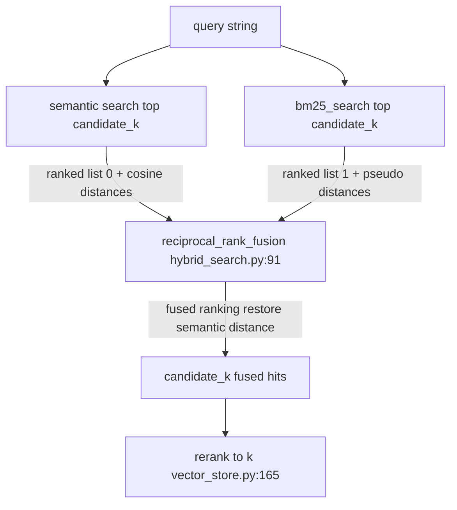

> **Critical Failure Mode**
> If RRF output distances are taken from BM25 pseudo-distance (list 1) instead of restored semantic distance (list 0), out-of-domain queries with incidental keyword overlap pass the relevance gate and reach the LLM with irrelevant context. The LLM then generates plausible-sounding but ungrounded answers. This was observed on dining-hall queries before the restore fix at [`hybrid_search.py:114-115`](hybrid_search.py).

---

### 2.7 Metadata Pre-Filtering

#### Problem statement

With only 163 chunks, full-corpus search is feasible. Metadata pre-filtering nonetheless improves precision by restricting ANN search to the document most likely to contain the answer, reducing contamination from semantically similar but wrong-source chunks (e.g., application deadlines in `spring_housing.txt` vs `application_process.txt`).

#### Theory and mechanics

`infer_filters(query)` ([`metadata.py:6-31`](metadata.py)) maps query substrings to ChromaDB `where` clauses:

| Query signal | Filter | Lines |
|--------------|--------|-------|
| `roomsurf`, `students say`, `review` | `{"source": "dorm_review.txt"}` | [`metadata.py:10-11`](metadata.py) |
| `nuin`, `spring returner`, `n.u.in` | `{"source": "spring_housing.txt"}` | [`metadata.py:13-14`](metadata.py) |
| `microwave`, `prohibited`, `what to bring` | `{"source": "what_to_bring.txt"}` | [`metadata.py:16-17`](metadata.py) |
| `outside furniture`, `bring` + `furniture/pack/allowed` | `{"source": "what_to_bring.txt"}` | [`metadata.py:19-22`](metadata.py) |
| `rate`, `per-semester`, `cost`, `price`, `$` | `{"source": "room_rates.txt"}` | [`metadata.py:24-25`](metadata.py) |
| `deadline`, `deposit`, `application` (not `nuin`) | `{"source": "application_process.txt"}` | [`metadata.py:27-29`](metadata.py) |
| No match | `None` (no filter) | [`metadata.py:31`](metadata.py) |

**Integration in `retrieve()`** ([`vector_store.py:150-154`](vector_store.py)):
```python
effective_where = where if where is not None else infer_filters(query)
semantic_hits = _semantic_search(query, candidate_k, where=effective_where)
if effective_where and len(semantic_hits) < k:
    semantic_hits = _semantic_search(query, candidate_k, where=None)
```

Chroma applies `where` as a pre-filter before ANN graph traversal — filtered vectors never enter the candidate pool.

#### Mathematical / algorithmic foundations

Let \(\mathcal{C}\) be full corpus, \(\mathcal{C}_f \subseteq \mathcal{C}\) be filtered subset. Search complexity drops from \(O(|\mathcal{C}|)\) to \(O(|\mathcal{C}_f|)\) for exact search; HNSW recall may change on smaller subgraphs. Precision improves when filter is correct; recall drops to zero when filter is wrong.

#### Literature and known limitations

Metadata filtering is standard in production RAG (vector DB vendors document `where` / pre-filter patterns). Known limitation: heuristic filters are brittle — substring matching is not semantic understanding. False positive filter → wrong document set. False negative (no filter when needed) → full corpus search (safe fallback).

#### This project's design

- **NUin exclusion on application filter** ([`metadata.py:27-28`](metadata.py)): queries containing both "application" and "nuin" do not route to `application_process.txt` — NUin deadlines live in `spring_housing.txt`.
- **Fallback on sparse results** ([`vector_store.py:153-154`](vector_store.py)): if filtered search returns fewer than `k` hits, retry without filter. Prevents empty retrieval when filter is too aggressive.
- **Explicit override:** `retrieve(query, where={...})` bypasses inference ([`vector_store.py:150`](vector_store.py)).

#### Code anchors

| Component | Lines |
|-----------|-------|
| `infer_filters` | [`metadata.py:6-31`](metadata.py) |
| Filter application + fallback | [`vector_store.py:150-154`](vector_store.py) |
| Chroma `where` passthrough | [`vector_store.py:111-112`](vector_store.py) |

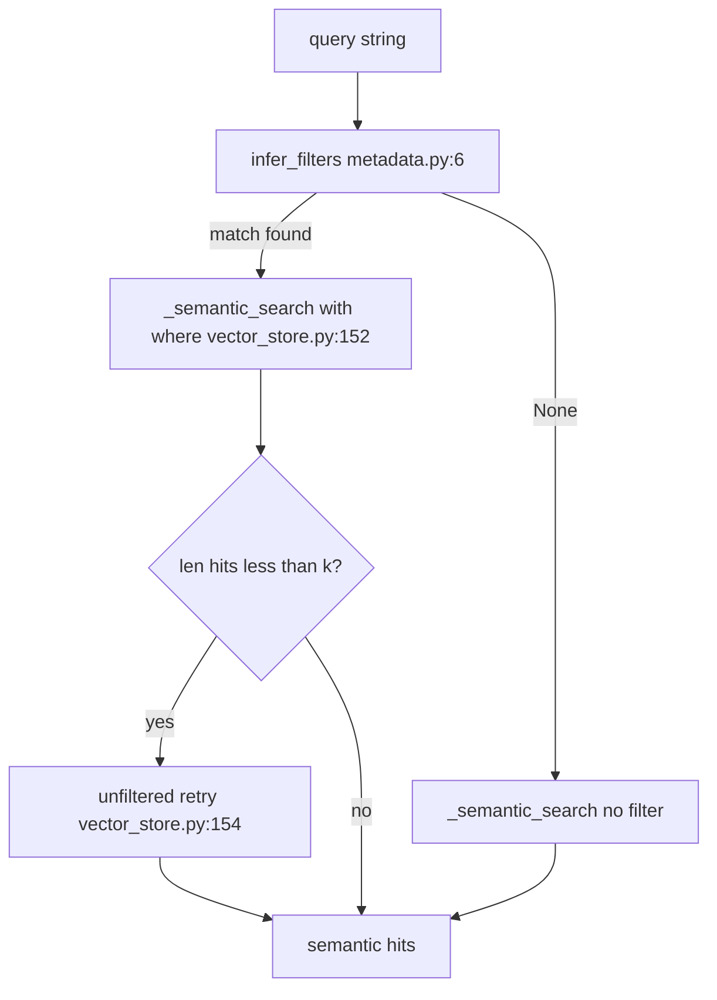

> **Critical Failure Mode**
> The substring `"application"` in [`metadata.py:27`](metadata.py) matches any query mentioning applications, including cross-document questions like *"How does the housing application relate to NUin spring return?"* If the NUin exclusion at [`metadata.py:28`](metadata.py) fails (different phrasing), the filter routes to `application_process.txt` and hides the correct `spring_housing.txt` chunk. Fallback at [`vector_store.py:153-154`](vector_store.py) mitigates only when filtered results are sparse, not when wrong-source results are abundant.

---

### 2.8 Heuristic Re-Ranking

#### Problem statement

First-stage retrievers (bi-encoder + BM25 + RRF) are optimized for recall, not final precision. A second-stage reranker reorders the candidate pool before the top-k cutoff, applying domain knowledge that general-purpose embeddings cannot encode.

#### Theory and mechanics

`rerank(query, hits, k)` ([`reranker.py:64-75`](reranker.py)):
1. For each hit, compute `adjusted_distance = score_chunk(query, hit)` ([`reranker.py:71`](reranker.py)).
2. Sort by `adjusted_distance` ascending (lower = better).
3. Return top-k.

`score_chunk()` ([`reranker.py:24-61`](reranker.py)) adds boost penalties to cosine distance:

| Query signal | Condition | Boost | Lines |
|--------------|-----------|-------|-------|
| Placement terms (`average`, `percentage`, `placed into`) | section contains `housing statistics` | −0.18 | [`reranker.py:31-33`](reranker.py) |
| Placement terms | text has `%` + housing style words | −0.10 | [`reranker.py:34-35`](reranker.py) |
| Placement terms | section is `timeline` or deadline language | +0.12 | [`reranker.py:36-37`](reranker.py) |
| Review terms (`students say`, `noise`, `wall`) | text has `thin wall`, `nupd`, `noise` | −0.08 | [`reranker.py:39-41`](reranker.py) |
| Review terms | source is `dorm_review.txt` | −0.04 | [`reranker.py:42-43`](reranker.py) |
| Policy terms (`microwave`, `furniture`, `bring`) | microwave/furniture/prohibited text | −0.15 | [`reranker.py:45-47`](reranker.py) |
| Policy terms | section is microwave/prohibited headers | −0.10 | [`reranker.py:48-49`](reranker.py) |
| Rate terms | source is `room_rates.txt` | −0.05 | [`reranker.py:51-53`](reranker.py) |
| Deadline terms | source is `application_process.txt` | −0.05 | [`reranker.py:55-57`](reranker.py) |
| Deadline terms | `spring_housing.txt` timeline section | +0.08 | [`reranker.py:58-59`](reranker.py) |

Final score: `adjusted_distance = distance + boost` ([`reranker.py:61`](reranker.py)). Negative boost improves rank; positive boost degrades rank.

#### Mathematical / algorithmic foundations

Heuristic reranking is a monotonic transform on the distance metric:

\[
d_{\text{adj}}(c) = d_{\text{cos}}(\mathbf{q}, \mathbf{c}) + b(q, \text{metadata}(c), \text{text}(c))
\]

where \(b\) is a hand-crafted boost function. This is not learned; it does not require training data but does not generalize beyond encoded rules.

**Alternative: cross-encoder reranking.** Models like `cross-encoder/ms-marco-MiniLM-L-6-v2` jointly encode \((q, c)\) pairs and output a relevance score. Accuracy: significantly higher on MS MARCO. Cost: \(O(k)\) forward passes per query (one per candidate), ~50-100ms per candidate on CPU.

#### Literature and known limitations

Nogueira & Cho (2019) establish cross-encoder reranking as SOTA for passage reranking. Heuristic reranking is a pre-deep-learning approach that remains viable for small domain-specific corpora where rules are enumerable. Known limitation: maintenance burden scales with query types; unseen phrasings get no boost.

#### This project's design

Boosts derived from eval failures:
- **Q4:** Housing Statistics −0.18 corrects Timeline outranking after chunking fix.
- **Q5:** Microwave section −0.15 corrects toiletries section contamination.
- **Q3:** NUPD/noise −0.08 ensures International Village review with NUPD detail ranks in top-k for generation synthesis.

Rejected cross-encoder: adds `sentence-transformers` CrossEncoder dependency, ~50ms × 10 candidates latency, marginal gain on 163-chunk corpus with good chunking.

#### Code anchors

| Component | Lines |
|-----------|-------|
| `score_chunk` | [`reranker.py:24-61`](reranker.py) |
| `rerank` | [`reranker.py:64-75`](reranker.py) |
| Query term sets | [`reranker.py:9-11`](reranker.py) |

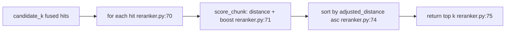

> **Critical Failure Mode**
> Hand-tuned boosts are invisible in test output when they happen to align with correct chunks. When a new query type partially matches a boost rule (e.g., `"average"` in a non-placement context), the wrong chunk receives −0.18 boost and displaces the correct chunk with no error signal — only answer quality degrades.

---

### 2.9 Grounded LLM Generation

#### Problem statement

Retrieval supplies evidence; the LLM must synthesize a natural-language answer strictly from that evidence. Without explicit constraints, LLMs confabulate facts not present in context (hallucination) — especially on numeric values and dates.

#### Theory and mechanics

**System prompt contract** ([`query.py:16-29`](query.py)):
- Answer ONLY from Retrieved Documents.
- Exact decline string if insufficient information.
- Cite source filenames in parentheses.
- Distinguish student reviews from official policy.
- Synthesize across all retrieved reviews; include NUPD if any review mentions it.

**Context assembly** ([`query.py:41-48`](query.py)):
```
Retrieved Documents:
[1] (source: spring_housing.txt | section: Housing Statistics)
{chunk text}
...
Question: {user question}
```

**Message construction** ([`query.py:108-116`](query.py)):
1. System message with `SYSTEM_PROMPT`.
2. Prior conversation turns (if any) as role/content pairs.
3. Final user message with context + question.

**Groq API call** ([`query.py:118-123`](query.py)):
- Model: `llama-3.3-70b-versatile` ([`config.py:26`](config.py))
- Temperature: `0.2` ([`config.py:27`](config.py))

**Three-layer grounding enforcement:**

| Layer | Mechanism | Lines |
|-------|-----------|-------|
| Pre-generation gate | `distance < MAX_DISTANCE` filter | [`query.py:98`](query.py) |
| No-context short-circuit | Return `DECLINE_MESSAGE` without API call | [`query.py:100-106`](query.py) |
| Post-generation decline | If decline text in answer, clear sources | [`query.py:126-132`](query.py) |

#### Mathematical / algorithmic foundations

Generation samples from:

\[
P(y \mid q, \mathcal{G}, \text{system prompt}) \approx \prod_{t} P(y_t \mid y_{<t}, \text{context}(\mathcal{G}), q, \text{system})
\]

with temperature \(\tau = 0.2\) scaling logits before softmax:

\[
P(y_t) \propto \exp(z_t / \tau)
\]

Lower \(\tau\) sharpens distribution → less creative deviation from context. This is **prompt-based grounding**, not constrained decoding (token-level masking to context vocabulary). The model can still hallucinate tokens not in context.

#### Literature and known limitations

Gao et al. (2023) RAG survey: generation quality ceiling is set by retrieval precision and context signal-to-noise ratio. Shi et al. (2023) "lost in the middle" effect: LLMs underweight context in the middle of long prompts. With k=5 and ~1600-char chunks, total context ≈ 8000 chars — within reliable attention range for 70B models.

Known limitation: prompt grounding is soft constraint. Models violate instructions, especially under adversarial context or when context is ambiguous.

#### This project's design

- **Decline clears sources** ([`query.py:126-132`](query.py)): if LLM outputs decline message, UI must not show retrieved sources (fixes integration test failure where OOD dining hall query showed housing sources).
- **Source list from retrieval metadata**, not LLM citations ([`query.py:134-138`](query.py), [`app.py:35-37`](app.py)).
- **Temperature 0.2** vs 0.0: allows minor paraphrase for readability while limiting hallucination.

#### Code anchors

| Component | Lines |
|-----------|-------|
| `SYSTEM_PROMPT` | [`query.py:16-29`](query.py) |
| `_format_context` | [`query.py:41-48`](query.py) |
| `ask` generation path | [`query.py:86-145`](query.py) |
| `DECLINE_MESSAGE` | [`config.py:28`](config.py) |
| `_get_client` | [`query.py:32-37`](query.py) |

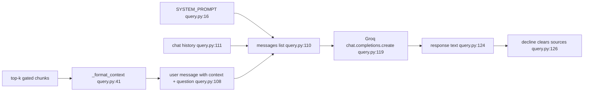

> **Critical Failure Mode**
> The LLM may cite `(source: room_rates.txt)` in prose while the actual fact came from a different retrieved chunk. The UI appends sources from retrieval metadata ([`app.py:35-37`](app.py)), not from LLM-parsed citations. Users trusting inline LLM citations over the metadata source list may be misled. This is inherent to soft prompt grounding without citation verification.

---

### 2.10 Conversational Memory

#### Problem statement

Single-turn RAG cannot resolve anaphoric follow-ups: *"What about triple rooms?"* after asking about Kerr Hall doubles. The retrieval query must be augmented with prior context; the generation prompt must include conversation history for coherent multi-turn responses.

#### Theory and mechanics

Two **asymmetric** memory channels:

**1. Retrieval query augmentation** — `_retrieval_query()` ([`query.py:73-83`](query.py)):
- If no history: return question unchanged ([`query.py:75-76`](query.py)).
- Find last user message in history ([`query.py:77-79`](query.py)).
- If last user message differs from current question: return `"{last_user} {question}"` ([`query.py:81-82`](query.py)).

**2. Generation history** — `ask()` ([`query.py:111-115`](query.py)):
- Append all prior turns (user + assistant) to Groq messages list.
- Assistant prior answers are visible to the LLM but **not** concatenated into the embedding query.

**UI integration** — `chat_fn()` ([`app.py:26-33`](app.py)):
- Convert Gradio history via `_history_to_messages()` ([`app.py:19-23`](app.py)).
- Pass to `ask(message, history=prior)`.

#### Mathematical / algorithmic foundations

Retrieval query transformation:

\[
q_{\text{retrieval}} = \begin{cases}
q_{\text{current}} & \text{if } H = \emptyset \\
q_{\text{last user}} \oplus q_{\text{current}} & \text{if } q_{\text{last user}} \neq q_{\text{current}} \\
q_{\text{current}} & \text{otherwise}
\end{cases}
\]

where \(\oplus\) is string concatenation with space separator.

This is a minimal query rewriting strategy — not full coreference resolution. Embedding of concatenated string is a single bi-encoder pass; no multi-vector attention over history.

#### Literature and known limitations

Conversational RAG literature (e.g., CONDENSER, query rewriting with LLMs) uses learned or LLM-generated reformulations. Concatenation is a zero-cost baseline with known failure on pronoun-only follow-ups lacking explicit entities in the prior turn.

#### This project's design

- **Only last user turn** used for retrieval (not full history): prevents embedding query pollution from long assistant responses containing LLM phrasing.
- **Eval case** ([`tests/eval_cases.py:84-88`](tests/eval_cases.py)): turn 1 Kerr Hall double → turn 2 "What about triple rooms?" must retrieve `$5,205` triple rate.

#### Code anchors

| Component | Lines |
|-----------|-------|
| `_retrieval_query` | [`query.py:73-83`](query.py) |
| History in messages | [`query.py:111-115`](query.py) |
| `_history_to_messages` | [`app.py:19-23`](app.py) |
| `FOLLOW_UP_TEST` | [`tests/eval_cases.py:84-88`](tests/eval_cases.py) |

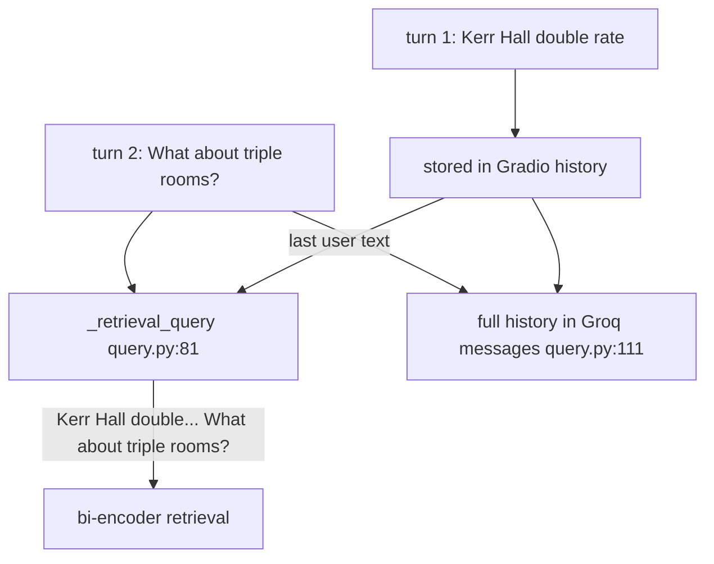

> **Critical Failure Mode**
> Pronoun-only follow-ups without entity in the prior user turn fail retrieval: *"What about that building?"* after an assistant response (not user message) mentioned Kerr Hall. `_retrieval_query` reads only the last **user** turn ([`query.py:77-78`](query.py)), not assistant text. The embedding query lacks the building name entirely.

---

### 2.11 Gradio ChatInterface

#### Problem statement

The RAG pipeline is CLI-accessible via `ask()` but requires a user-facing interface. Gradio provides a pre-built chat UI; the integration layer must normalize message schemas and attach retrieval metadata to responses.

#### Theory and mechanics

`gr.ChatInterface(fn=chat_fn, ...)` ([`app.py:43-53`](app.py)):
- `chat_fn(message, history)` receives current message and prior turns.
- Returns assistant response string displayed in chatbot.

`chat_fn()` flow ([`app.py:26-40`](app.py)):
1. `normalize_content(message).strip()` ([`app.py:27`](app.py)).
2. Convert history to OpenAI-style messages ([`app.py:32`](app.py)).
3. `ask(message, history=prior)` ([`app.py:33`](app.py)).
4. Append `**Retrieved from:**` source list if non-empty ([`app.py:35-37`](app.py)).

`normalize_content()` ([`query.py:52-70`](query.py)) coerces:
- `str` → unchanged
- `list` of str/dict → join text parts (Gradio 6 format: `[{"text": "..."}]`)
- `dict` with `text` or `content` key → extract string
- `None` → `""`

`ensure_index()` called at module import ([`app.py:8`](app.py)) — builds index on first launch if empty.

#### Literature and known limitations

Gradio 6.x changed default message format; `type="messages"` parameter removed from `ChatInterface`. Message content may be multimodal (list of parts) rather than plain strings.

#### This project's design

- No `type="messages"` on `ChatInterface` (Gradio 6.17+ compatibility).
- `normalize_content` shared between `app.py` and `query.py` to handle schema variance.
- Five `EXAMPLE_QUESTIONS` from eval suite ([`app.py:10-16`](app.py)).

#### Code anchors

| Component | Lines |
|-----------|-------|
| `ensure_index` at import | [`app.py:8`](app.py) |
| `_history_to_messages` | [`app.py:19-23`](app.py) |
| `chat_fn` | [`app.py:26-40`](app.py) |
| `ChatInterface` | [`app.py:43-53`](app.py) |
| `normalize_content` | [`query.py:52-70`](query.py) |

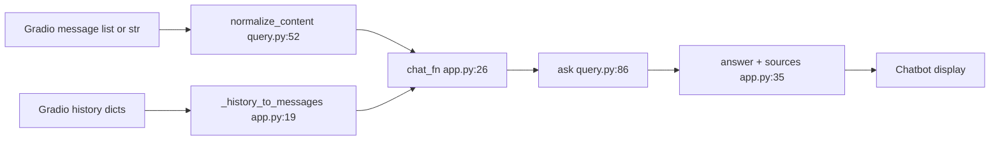

> **Critical Failure Mode**
> Gradio 6 passes `message` as `[{"text": "..."}]` (list), not `str`. Calling `.strip()` directly on `message` raises `AttributeError: 'list' object has no attribute 'strip'`, crashing the chat handler. Fixed by `normalize_content()` at [`app.py:27`](app.py) before any string operations.

---

### 2.12 Centralized Configuration

#### Problem statement

Hyperparameters scattered across modules create inconsistent behavior (e.g., `MAX_DISTANCE` in `query.py` while `TOP_K` in `vector_store.py`) and make reproducibility and tuning difficult.

#### Theory and mechanics

[`config.py`](config.py) is the single source of truth for all tunable pipeline parameters:

- **Paths** ([`config.py:7-10`](config.py)): `PROJECT_ROOT`, `DOCUMENTS_DIR`, `CHROMA_DIR`, `BM25_INDEX_PATH`
- **Retrieval** ([`config.py:13-18`](config.py)): embedding model, top-k, candidate multiplier, distance threshold, batch size
- **Hybrid** ([`config.py:21-23`](config.py)): enable flag, BM25 top-k, RRF constant
- **Generation** ([`config.py:26-28`](config.py)): LLM model, temperature, decline message
- **Chunking** ([`config.py:31-34`](config.py)): size, overlap, max size, min length

Frozen `RAGConfig` dataclass ([`config.py:37-55`](config.py)) groups parameters for documentation and future CLI tooling. `CONFIG = RAGConfig()` singleton at [`config.py:55`](config.py).

Modules import constants directly: `from config import MAX_DISTANCE` in [`query.py:11`](query.py), etc.

#### Literature and known limitations

Configuration externalization is standard practice (12-factor app methodology). Limitation: changing chunking constants without index rebuild creates silent inconsistency between config and on-disk indexes.

#### This project's design

v1 had `MAX_DISTANCE=0.65` hardcoded in `query.py`. Production upgrade centralized all constants and tightened to 0.55 ([`config.py:17`](config.py)).

#### Code anchors

| Component | Lines |
|-----------|-------|
| All constants | [`config.py:6-34`](config.py) |
| `RAGConfig` dataclass | [`config.py:37-55`](config.py) |

> **Critical Failure Mode**
> Changing `CHUNK_SIZE` or `CHUNK_OVERLAP` in [`config.py:31-32`](config.py) without deleting `chroma_db/` and `data/bm25_index.pkl` leaves indexes built with old parameters. `ensure_index()` sees non-empty collection and skips rebuild ([`vector_store.py:170`](vector_store.py)). Retrieval operates on stale chunk boundaries indefinitely.

---

### 2.13 API Keys and Environment Variables

#### Problem statement

The Groq API requires authentication. API keys must not be committed to version control and must be loadable across local development and CI environments.

#### Theory and mechanics

`load_dotenv()` at [`query.py:14`](query.py) loads `.env` into process environment at import time.

`_get_client()` ([`query.py:32-37`](query.py)):
```python
api_key = os.getenv("GROQ_API_KEY")
if not api_key or api_key == "your_key_here":
    raise RuntimeError("GROQ_API_KEY is missing...")
return Groq(api_key=api_key)
```

Template: [`.env.example:7`](.env.example) with placeholder `your_key_here`.

CI integration job: `GROQ_API_KEY: ${{ secrets.GROQ_API_KEY }}` ([`.github/workflows/ci.yml:41-42`](.github/workflows/ci.yml)).

#### Literature and known limitations

dotenv pattern loads secrets from local file not tracked in git ([`.gitignore`](.gitignore) excludes `.env`). Limitation: `load_dotenv()` searches from cwd upward; wrong working directory misses `.env`.

#### This project's design

- Placeholder detection prevents silent failure with template value ([`query.py:34`](query.py)).
- Integration tests marked `@pytest.mark.integration` skip when key missing.
- CI integration job `continue-on-error: true` ([`.github/workflows/ci.yml:44`](.github/workflows/ci.yml)) — fast tests gate merge; integration is informational.

#### Code anchors

| Component | Lines |
|-----------|-------|
| `load_dotenv` | [`query.py:14`](query.py) |
| `_get_client` | [`query.py:32-37`](query.py) |
| `.env.example` | [`.env.example:7`](.env.example) |
| CI secret | [`.github/workflows/ci.yml:41-44`](.github/workflows/ci.yml) |

> **Critical Failure Mode**
> Starting `python app.py` from a directory other than project root causes `load_dotenv()` to miss `.env`. `_get_client()` raises `RuntimeError` on first query, not at startup — the UI loads but every message fails. No automatic path resolution to `PROJECT_ROOT`.

---

### 2.14 Pytest and Continuous Integration

#### Problem statement

RAG systems fail silently — plausible wrong answers pass manual inspection. Automated tests at retrieval and generation layers catch regressions in chunking, ranking, and grounding.

#### Theory and mechanics

**Test pyramid:**

| Tier | Count | Marker | API key | CI job |
|------|-------|--------|---------|--------|
| Fast (retrieval, chunking, metadata, hybrid) | 19 | `not integration` | Not required | `test` ([`.github/workflows/ci.yml:23-24`](.github/workflows/ci.yml)) |
| Integration (end-to-end Groq) | 7 | `integration` | Required | `integration` ([`.github/workflows/ci.yml:40-44`](.github/workflows/ci.yml)) |

**Session fixture** ([`tests/conftest.py:11-16`](tests/conftest.py)):
```python
@pytest.fixture(scope="session")
def indexed_chunks():
    chunks = build_chunks(load_documents())
    build_index(chunks, reset=True)
    return chunks
```
Rebuilds index once per pytest session — ensures tests run against current chunking logic.

**Eval cases** ([`tests/eval_cases.py:5-44`](tests/eval_cases.py)): 5 parameterized retrieval queries with `expected_source`, `must_contain`, optional `preferred_section`.

**Markers** ([`pytest.ini:2-3`](pytest.ini)): `integration` marker for Groq-dependent tests.

#### Mathematical / algorithmic foundations

Retrieval eval is binary per criterion:
- `source_ok`: top hit `source` == `expected_source`
- `content_ok`: any top-k hit text contains all `must_contain` strings
- `section_ok`: top hit `section` == `preferred_section` (when specified)

Generation eval adds LLM output checks: `must_contain` in answer text, decline message on OOD queries.

#### Literature and known limitations

RAG evaluation literature (RAGAS, TruLens) advocates automatic metrics (faithfulness, answer relevance). This project uses deterministic string-matching eval — cheaper, reproducible, but cannot detect paraphrased correct answers or subtle hallucinations.

#### This project's design

- Shared `EVAL_QUERIES` in [`tests/eval_cases.py`](tests/eval_cases.py) used by pytest and CLI scripts `test_retrieval.py`, `test_generation.py`.
- `compare_chunking.py` benchmarks Strategy A vs B in isolated temp ChromaDB ([`compare_chunking.py:40-52`](compare_chunking.py)) — resets global singletons to avoid readonly errors.
- Python 3.11 in CI ([`.github/workflows/ci.yml:17`](.github/workflows/ci.yml)).

#### Code anchors

| Component | Lines |
|-----------|-------|
| Session fixture | [`tests/conftest.py:11-16`](tests/conftest.py) |
| `EVAL_QUERIES` | [`tests/eval_cases.py:5-44`](tests/eval_cases.py) |
| `IN_DOMAIN_TESTS` | [`tests/eval_cases.py:46-77`](tests/eval_cases.py) |
| `OUT_OF_DOMAIN_TEST` | [`tests/eval_cases.py:79-82`](tests/eval_cases.py) |
| `FOLLOW_UP_TEST` | [`tests/eval_cases.py:84-88`](tests/eval_cases.py) |
| CI fast tests | [`.github/workflows/ci.yml:23-24`](.github/workflows/ci.yml) |
| CI integration | [`.github/workflows/ci.yml:40-44`](.github/workflows/ci.yml) |

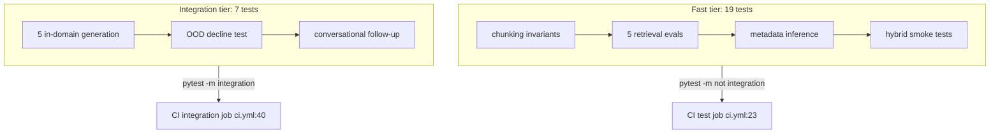

> **Critical Failure Mode**
> The session-scoped `indexed_chunks` fixture rebuilds index at pytest start but not on subsequent runs if pytest reuses session cache in IDE "run test" mode with live `chroma_db/` from manual `app.py` usage. Local index state may diverge from test expectations without failure — only answer quality in manual testing reveals the drift.

---

### 2.15 RAG as System Architecture

#### Problem statement

Individual components (chunking, embedding, BM25, RRF, reranking, generation) must be understood as a coupled system with distinct failure surfaces. Optimizing one stage in isolation can degrade end-to-end performance.

#### Theory and mechanics

**Formal RAG definition** (Lewis et al., 2020):

Given corpus \(\mathcal{C} = \{c_1, \ldots, c_N\}\), query \(q\), retriever \(R(q, \mathcal{C}) \rightarrow \mathcal{G}\), generator \(G(q, \mathcal{G}) \rightarrow y\):

\[
y = G\big(q, R(q, \mathcal{C})\big)
\]

In this implementation:
- \(R\) = metadata filter → semantic ANN → BM25 → RRF → heuristic rerank → top-k ([`vector_store.py:134-165`](vector_store.py))
- \(G\) = Groq LLM with system prompt and formatted context ([`query.py:108-123`](query.py))
- Gating: if all \(c \in \mathcal{G}\) have \(d_{\text{cos}} \geq 0.55\), then \(\mathcal{G} = \emptyset\) and \(G\) is not invoked

#### Failure taxonomy

| Failure class | Symptom | Root cause stage | Example in this repo |
|---------------|---------|------------------|----------------------|
| **Chunking failure** | Right doc, wrong section in top hit | Section 2.2 | Q4 Timeline ranked above Housing Statistics (v1) |
| **Retrieval failure** | Wrong chunk in top-k | Sections 2.3–2.8 | BM25 pseudo-distance gate bug (fixed) |
| **Gating failure** | Decline when answer exists | Section 2.4 | \(\tau=0.55\) too tight for paraphrased query |
| **Generation failure** | Correct chunks, wrong answer | Section 2.9 | LLM omits NUPD detail from retrieved review |
| **Memory failure** | Follow-up retrieves wrong entity | Section 2.10 | Pronoun-only follow-up without prior user turn |
| **UI failure** | Crash or missing sources | Sections 2.11, 2.9 | Gradio list `.strip()` crash (fixed) |

#### Literature and known limitations

Gao et al. (2023) identify the "retrieval-generation gap": improving retriever recall does not monotonically improve answer quality if generator ignores context. This repo mitigates via strict system prompt, low temperature, and decline-on-empty-retrieval.

#### This project's design

Production architecture evolved from v1 (recursive-only chunking, semantic-only retrieval, `MAX_DISTANCE=0.65`, no metadata filter, no reranker) through eval-driven additions. Each layer addresses a measured failure, not speculative complexity.

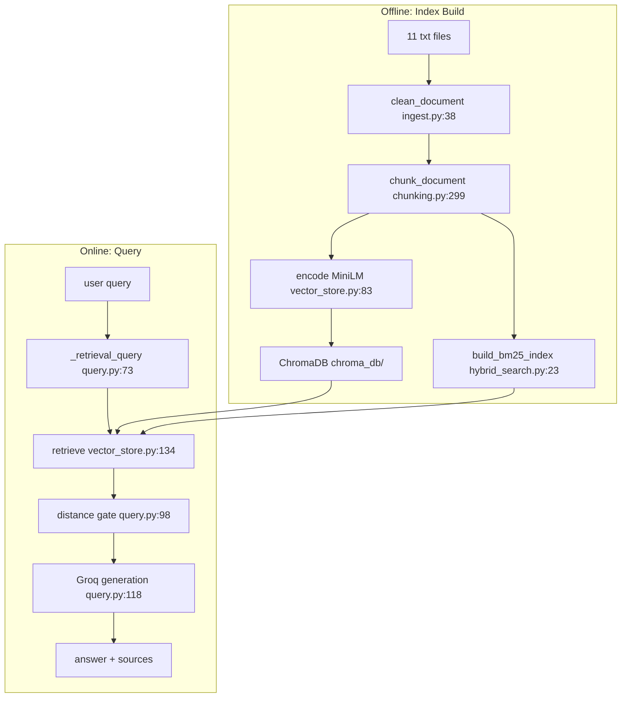

> **Critical Failure Mode**
> End-to-end RAG systems exhibit **compound failure**: a marginal chunking error (5% wrong section boundaries) combined with a marginal retrieval error (wrong chunk at rank 2 instead of rank 1) and a generation model that prefers rank-1 context produces confident wrong answers. No single component test catches this — only full integration eval ([`tests/eval_cases.py`](tests/eval_cases.py)) exercises the compound path.

---

## 3. End-to-End Walkthrough

**Canonical query** (eval Q4, [`tests/eval_cases.py:28-33`](tests/eval_cases.py)):

> *"On average, what housing styles are NUin spring returners placed into?"*

**Expected outcome:** Top retrieved chunk from `spring_housing.txt`, section `Housing Statistics`, containing `85%` apartment placement statistic. Grounded answer cites percentages from that section.

### 3.1 Step-by-Step Trace

#### Step 1 — UI entry

User submits query in Gradio. `chat_fn(message, history)` executes ([`app.py:26`](app.py)).

- [`app.py:27`](app.py): `message = normalize_content(message).strip()` — coerces Gradio list/dict to string.
- [`app.py:32`](app.py): `prior = _history_to_messages(history)` — empty on turn 1.
- [`app.py:33`](app.py): `result = ask(message, history=prior)`.

#### Step 2 — Retrieval query formation

Inside `ask()` ([`query.py:86`](query.py)):

- [`query.py:92`](query.py): `question = question.strip()`.
- [`query.py:96`](query.py): `retrieval_q = _retrieval_query(question, history)`.
- [`query.py:75-76`](query.py): no history → `retrieval_q` = original question unchanged.

#### Step 3 — Retrieve orchestration

[`query.py:97`](query.py): `chunks = retrieve(retrieval_q, k=5)`.

Inside `retrieve()` ([`vector_store.py:134`](vector_store.py)):

- [`vector_store.py:145-148`](vector_store.py): `candidate_k = min(163, max(5, 5*2)) = 10`.
- [`vector_store.py:150`](vector_store.py): `effective_where = infer_filters(query)`.

#### Step 4 — Metadata inference

[`metadata.py:13-14`](metadata.py): query contains `"nuin"` (via `"NUin"` lowercased) → `{"source": "spring_housing.txt"}`.

#### Step 5 — Semantic search

[`vector_store.py:152`](vector_store.py): `_semantic_search(query, k=10, where={"source": "spring_housing.txt"})`.

Inside `_semantic_search()` ([`vector_store.py:97`](vector_store.py)):

- [`vector_store.py:104`](vector_store.py): encode query → \(\mathbf{q} \in \mathbb{R}^{384}\).
- [`vector_store.py:114`](vector_store.py): `collection.query(..., n_results=10, where={"source": "spring_housing.txt"})`.
- Returns 10 hits with cosine distances. Housing Statistics chunk likely among top semantic hits (placement percentages text).

Fallback at [`vector_store.py:153-154`](vector_store.py) not triggered (≥ 5 hits from filtered search).

#### Step 6 — BM25 search

[`vector_store.py:157`](vector_store.py): `keyword_hits = bm25_search(query, k=10)`.

Inside `bm25_search()` ([`hybrid_search.py:60`](hybrid_search.py)):

- Tokenize: `["on", "average", "what", "housing", "styles", "are", "nuin", "spring", "returners", "placed", "into"]`.
- Score all 163 chunks; rank by BM25 score.
- `spring_housing.txt` chunks with "housing", "nuin", "placed" score highly.

#### Step 7 — Reciprocal rank fusion

[`vector_store.py:159`](vector_store.py): `fused = reciprocal_rank_fusion([semantic_hits, keyword_hits], k=10, rrf_k=60)`.

Inside RRF ([`hybrid_search.py:101-116`](hybrid_search.py)):

- Housing Statistics chunk appearing in both lists accumulates:
  - Semantic rank \(r_1\): RRF contribution \(1/(60+r_1)\)
  - BM25 rank \(r_2\): RRF contribution \(1/(60+r_2)\)
- Fused score favors consensus chunks.
- [`hybrid_search.py:114-115`](hybrid_search.py): distance restored from semantic list (not BM25 pseudo-distance).

#### Step 8 — Heuristic reranking

[`vector_store.py:165`](vector_store.py): `return rerank(query, fused, k=5)`.

Inside `score_chunk()` ([`reranker.py:31-33`](reranker.py)):

- Query has `"average"` and `"placed into"` → placement terms match.
- Housing Statistics section → `boost -= 0.18`.
- Timeline section chunks (if present) → `boost += 0.12` ([`reranker.py:36-37`](reranker.py)).
- Housing Statistics chunk rises to rank 1.

#### Step 9 — Distance gate

Back in `ask()` ([`query.py:98`](query.py)):

```python
chunks = [c for c in chunks if c["distance"] < 0.55]
```

Housing Statistics chunk at cosine distance ~0.35 passes. If all chunks failed, [`query.py:100-106`](query.py) returns decline without Groq call.

#### Step 10 — Context formatting

[`query.py:108`](query.py): `user_message = f"{_format_context(chunks)}Question: {question}"`.

[`query.py:41-48`](query.py) produces:
```
Retrieved Documents:
[1] (source: spring_housing.txt | section: Housing Statistics)
[Source: spring_housing.txt | Section: Housing Statistics]
...85% apartment... 10% suite... 5% traditional...
Question: On average, what housing styles are NUin spring returners placed into?
```

#### Step 11 — Groq generation

[`query.py:110-116`](query.py): messages = system + history + user message.

[`query.py:118-123`](query.py):
```python
client.chat.completions.create(
    model="llama-3.3-70b-versatile",
    messages=messages,
    temperature=0.2,
)
```

LLM synthesizes answer citing `85%`, `10%`, `5%` from context.

#### Step 12 — Decline check and source assembly

[`query.py:124`](query.py): extract answer text.

[`query.py:126-132`](query.py): if decline message in answer → clear sources (not triggered for Q4).

[`query.py:134-138`](query.py): `sources = sorted({c["source"] for c in chunks})`.

#### Step 13 — UI response

[`app.py:34-37`](app.py):
```python
answer = result["answer"]
if result["sources"]:
    sources = "\n".join(f"• {s}" for s in result["sources"])
    answer = f"{answer}\n\n**Retrieved from:**\n{sources}"
```

User sees grounded answer with `• spring_housing.txt` attribution.

### 3.2 Sequence Diagram

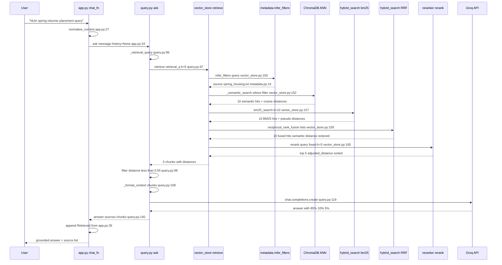

---

## 4. Learning Path (Concept Dependency Order)

### Step 1 — Data models

**Prerequisites:** Python `@dataclass`, type hints.

**Read:** [`models.py:4-28`](models.py) — `Document`, `Chunk`, `with_metadata_prefix()`.

**Run:** none.

**Observe:** Two types separate raw file from retrieval unit; prefix format `[Source: ... | Section: ...]`.

---

### Step 2 — Ingestion and cleaning

**Prerequisites:** Step 1.

**Read:** [`ingest.py:19-62`](ingest.py).

**Run:** `python ingest.py`

**Observe:** `TOTAL CHUNKS: 163`, Kerr Hall spot-check PASS, 8 dorm review chunks.

---

### Step 3 — Chunking

**Prerequisites:** Steps 1–2.

**Read:** [`chunking.py:299-316`](chunking.py) router, [`chunking.py:202-247`](chunking.py) header split, [`chunking.py:105-136`](chunking.py) recursive split.

**Run:** `python compare_chunking.py`

**Observe:** Strategy B passes Q4 `section_ok` and Q5 `section_ok`; Strategy A fails both.

---

### Step 4 — Dense embeddings

**Prerequisites:** Step 3 (chunked text exists).

**Read:** [`vector_store.py:28-32`](vector_store.py), [`vector_store.py:50-52`](vector_store.py), [`vector_store.py:56-89`](vector_store.py).

**Run:** `python test_retrieval.py` (builds index if needed).

**Observe:** Q1 Kerr Hall rank #1, distance ~0.26.

---

### Step 5 — Vector ANN search and distance gating

**Prerequisites:** Step 4.

**Read:** [`vector_store.py:97-131`](vector_store.py), [`config.py:17`](config.py), [`query.py:98`](query.py).

**Observe:** `MAX_DISTANCE=0.55` filters weak hits before LLM.

---

### Step 6 — BM25

**Prerequisites:** Step 4.

**Read:** [`hybrid_search.py:13-88`](hybrid_search.py).

**Observe:** Tokenization strips `$` and punctuation; BM25 complements semantic on exact tokens.

---

### Step 7 — Hybrid RRF

**Prerequisites:** Steps 5–6.

**Read:** [`hybrid_search.py:91-117`](hybrid_search.py), [`vector_store.py:156-161`](vector_store.py).

**Observe:** Semantic distance restored post-fusion at [`hybrid_search.py:114-115`](hybrid_search.py).

---

### Step 8 — Metadata filtering

**Prerequisites:** Step 5.

**Read:** [`metadata.py:6-31`](metadata.py), [`vector_store.py:150-154`](vector_store.py).

**Observe:** Q4 query triggers `spring_housing.txt` filter via `"nuin"` substring.

---

### Step 9 — Heuristic reranking

**Prerequisites:** Step 7.

**Read:** [`reranker.py:24-75`](reranker.py).

**Observe:** Placement query boosts Housing Statistics section by −0.18.

---

### Step 10 — Grounded generation

**Prerequisites:** Steps 5, 9.

**Read:** [`query.py:16-29`](query.py), [`query.py:41-48`](query.py), [`query.py:86-145`](query.py).

**Run:** `pytest -m integration -v` (requires `GROQ_API_KEY`).

**Observe:** In-domain answers cite filenames; OOD dining hall returns exact decline message.

---

### Step 11 — Conversational memory

**Prerequisites:** Step 10.

**Read:** [`query.py:73-83`](query.py), [`app.py:19-33`](app.py), [`tests/eval_cases.py:84-88`](tests/eval_cases.py).

**Run:** `python app.py` → Kerr double → "What about triple rooms?"

**Observe:** Follow-up retrieves `$5,205` without re-stating Kerr Hall.

---

### Step 12 — Gradio UI

**Prerequisites:** Step 11.

**Read:** [`app.py:8-53`](app.py), [`query.py:52-70`](query.py).

**Observe:** Sources appended from retrieval metadata, not LLM text.

---

### Step 13 — Configuration and secrets

**Prerequisites:** All prior steps.

**Read:** [`config.py:6-55`](config.py), [`query.py:14`](query.py), [`query.py:32-37`](query.py), [`.env.example`](.env.example).

---

### Step 14 — Testing and CI

**Prerequisites:** Steps 1–13.

**Read:** [`tests/conftest.py:11-16`](tests/conftest.py), [`tests/eval_cases.py`](tests/eval_cases.py), [`pytest.ini`](pytest.ini), [`.github/workflows/ci.yml`](.github/workflows/ci.yml).

**Run:**
```bash
pytest -m "not integration" -v   # 19 passed
pytest -m integration -v         # 7 passed with API key
```

---

### Step 15 — Architecture synthesis

**Prerequisites:** All prior steps.

**Read:** Section 2.15 of this document.

**Synthesize:** Trace any eval query through ingest → index → retrieve → gate → generate → UI without opening source files.

---

## 5. Quick Reference

### Setup

```bash
python -m venv .venv && source .venv/bin/activate
pip install -r requirements.txt
cp .env.example .env   # set GROQ_API_KEY
```

### Commands

| Command | Purpose |
|---------|---------|
| `python ingest.py` | Inspect chunk count and health checks |
| `python compare_chunking.py` | Strategy A vs B benchmark |
| `python test_retrieval.py` | Retrieval eval (no API key) |
| `python test_generation.py` | Full generation eval (API key) |
| `python app.py` | Launch Gradio UI at http://127.0.0.1:7860 |
| `pytest -m "not integration" -v` | 19 fast tests |
| `pytest -m integration -v` | 7 Groq integration tests |

### Eval Queries

| ID | Query (abbreviated) | Expected source | Key fact |
|----|---------------------|-----------------|----------|
| Q1 | Kerr Hall double rate 2025-2026 | `room_rates.txt` | `$5,315` |
| Q2 | Fall 2026 application + deposit deadlines | `application_process.txt` | `May 7, 2026`, `May 1, 2026` |
| Q3 | IV noise and wall thickness reviews | `dorm_review.txt` | `thin`, `wall`, `nupd` |
| Q4 | NUin spring returner placement averages | `spring_housing.txt` | `85%`, section Housing Statistics |
| Q5 | Microwave and outside furniture policy | `what_to_bring.txt` | microwave rules, outside furniture |

### Constants (from [`config.py`](config.py))

| Parameter | Value |
|-----------|-------|
| Embedding model | `all-MiniLM-L6-v2` |
| Vector dimension | 384 |
| Top-k | 5 |
| Candidate multiplier | 2 (→ 10 candidates) |
| MAX_DISTANCE | 0.55 |
| RRF_K | 60 |
| CHUNK_SIZE / OVERLAP | 1600 / 240 |
| LLM | `llama-3.3-70b-versatile` @ τ=0.2 |
| Total chunks | 163 |

### Index rebuild

```bash
rm -rf chroma_db/ data/bm25_index.pkl
python -c "from ingest import build_chunks, load_documents; from vector_store import build_index; build_index(build_chunks(load_documents()), reset=True)"
```
